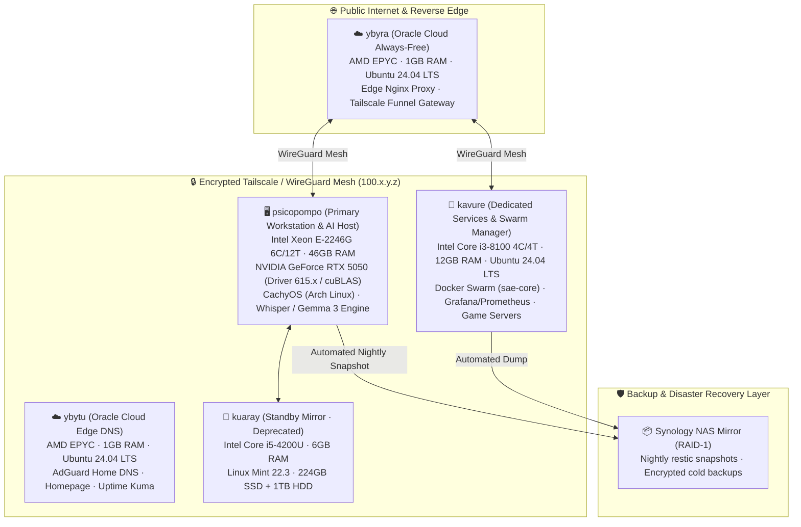

# 🏛️ Mnemocine Homelab — Distributed Sovereign Infrastructure

[](servers/psicopompo.md)
[](network/tailscale.md)
[](https://github.com/ceduardorodrig/STENIO-SENTINEL)
[](LICENSE-MIT)
[](servers/psicopompo.md)
[](https://github.com/ceduardorodrig)

> **"A resilient, 5-node hybrid cloud and sovereign AI infrastructure designed to operate free from foreign corporate cloud monopolies."**

---

## 📑 Table of Contents

- 🌐 [Overview & Philosophy](#-overview--philosophy)
- 📐 [Network & Node Architecture](#-network--node-architecture)
- 🖥️ [Hardware Specifications](#️-hardware-specifications)
- 🗂️ [Service Catalog](#️-service-catalog)
- 🔒 [Zero-Trust Security & Secrets Management](#-zero-trust-security--secrets-management)
- 💾 [Backup Strategy & Disaster Recovery](#-backup-strategy--disaster-recovery)
- 🛡️ [Automated Governance](#️-automated-governance)
- 📜 [License](#-license)

---

## 🌐 Overview & Philosophy

**Mnemocine** is the personal infrastructure and living laboratory of **Carlos Eduardo Rodrigues** ([@ceduardorodrig](https://github.com/ceduardorodrig)). 

Named after Mnemosyne (the Greek personification of memory), the homelab serves as the persistent memory, data foundation, and local artificial intelligence engine powering the **Sumænimá** ecosystem.

### Guiding Principles:
1. **Data Sovereignty:** Sensitive institutional, anthropological, and territorial community records never touch external third-party proprietary clouds.
2. **Hardware Re-Use & Upcycling:** Enterprise hardware paired with repurposed consumer machines and low-power cloud edge instances.
3. **Deterministic Governance:** All configurations, firewall policies, and services are continuously verified by **StenioSentinel** in sub-millisecond static passes.
4. **Resilient 3-2-1 Backups:** Immutable Btrfs snapshots, nightly off-site NAS mirrors, and encrypted cold cloud storage.

---

## 📐 Network & Node Architecture

The infrastructure operates across an encrypted, peer-to-peer **WireGuard / Tailscale mesh network**, connecting bare-metal local compute in Brasília to always-free edge instances in cloud datacenters:



---

## 🖥️ Hardware Specifications

| Node Name | Form Factor & Role | CPU & Architecture | Memory | Storage Configuration | Operating System |
|:---|:---|:---|:---:|:---|:---|
| **`psicopompo`** | Primary Workstation / AI Host | Intel Xeon E-2246G (6C/12T @ 3.6 GHz) + NVIDIA RTX 5050 | 46 GB DDR4 | 462 GB NVMe (OS) + 1.7 TB NVMe (Data) + 448 GB SSD + 1 TB HDD | **CachyOS** (Arch Linux) |
| **`kavure`** | Dedicated Services & Swarm Manager | Intel Core i3-8100 (4C/4T @ 3.6 GHz) | 12 GB DDR4 | 223 GB SSD (Future: M.2 SATA 1 TB + HDD 4-8 TB) | **Ubuntu 24.04.4 LTS** |
| **`kuaray`** | Standby Mirror / Archive (⚠️ Deprecated 28/08/2026) | Intel Core i5-4200U (2C/4T @ 1.6 GHz) | 6 GB DDR3 | 224 GB SSD + 1 TB HDD | **Linux Mint 22.3 (Zena)** |
| **`ybyra`** | Cloud Edge Reverse Proxy | AMD EPYC 7551 (2 vCPUs @ 2.0 GHz) | 1 GB RAM | 150 GB Block Storage | **Ubuntu 24.04.4 LTS** (OCI) |
| **`ybytu`** | Cloud Edge DNS & Telemetry | AMD EPYC 7551 (2 vCPUs @ 2.0 GHz) | 1 GB RAM | 50 GB Block Storage | **Ubuntu 24.04.4 LTS** (OCI) |

---

## 🗂️ Service Catalog

### 🧠 AI & Intelligent Speech Recognition
- **StênioREC v3.1.0:** Dual-stage real-time speech-to-text cockpit combining Whisper GGML Q8_0 (<500ms latency) and Gemma 3 IT for semantic purification.
- **Arandu TCG Engine:** Knowledge tokenization platform and card asset registry.

### 🌐 Edge Networking & DNS
- **AdGuard Home & Pi-hole:** Dual redundant network-level ad-blocking and recursive DNS resolvers across cloud and local nodes.
- **Tailscale Mesh:** WireGuard-based zero-trust network overlay with automated subnet routing and exit node capability.
- **Caddy & Nginx:** Reverse proxies with automatic Let's Encrypt SSL/TLS certificate renewal.

### 📊 Observability & Monitoring
- **Prometheus + Grafana + Loki:** Comprehensive telemetry aggregation, log streaming, and real-time GPU/CPU dashboading.
- **Uptime Kuma:** Multi-target ping, HTTP endpoint health tracking with instant push alerts.
- **ntfy:** Self-hosted lightweight push notifications delivering system events directly to mobile devices.

### 🎮 Low-Latency Dedicated Gaming
- **Project Zomboid Dedicated Server:** Custom modded persistence server hosted on `kavure` with live web administration panel.
- **Valheim Dedicated Server:** Synchronized survival server running on `kavure` with automated world backups.
- **Punktfunk:** Low-latency desktop and game streaming protocol.

---

## 🔒 Zero-Trust Security & Secrets Management

1. **SOPS / Age Cryptographic Store:** No credentials or API keys ever exist in plain text. Environment variables are encrypted using SOPS and Age keys (`.sops.yaml`).
2. **Automated Secret Scanners:** All code and documentation commits are blocked by **StenioSentinel** if unencrypted secrets (`SEC-SECRETS`, `SEC-SOPS-UNENCRYPTED`) are detected.
3. **NOPASSWD Local Principle:** Administrative sudo tasks follow deterministic sudoers configurations, eliminating plain-text password passing in pipelines.

---

## 💾 Backup Strategy & Disaster Recovery

- **3-2-1 Strategy:** 3 copies of all critical data, across 2 different media formats (NVMe + Synology RAID NAS), with 1 encrypted off-site copy.
- **Immutable Btrfs Snapshots:** Subvolume snapshots generated via Snapper before and after major system transitions.
- **Config Backup Pipeline:** Daily automated config mirrors pushed to encrypted NAS storage and private backup repositories.

---

## 🛡️ Automated Governance

All configuration manifests, documentation links, and operational rules in this repository are continuously audited by **[StenioSentinel](https://github.com/ceduardorodrig/STENIO-SENTINEL)**:

```bash
# Run homelab-specific static verification
stenio --scope homelab

# Check mesh network socket latency across all 5 nodes
stenio --mesh

# Full-spectrum diagnostic (NVMe, RAM, GPU, Services)
stenio --health
```

---

## 📜 License

- **Documentation & Architecture Manifests:** [Creative Commons Attribution 4.0 International (CC-BY-4.0)](https://creativecommons.org/licenses/by/4.0/)
- **Scripts & Operational Tooling:** [MIT License](LICENSE-MIT) / [Apache 2.0](LICENSE-APACHE)

---

<div align="center">

> **Yes... This is a Vibe Coded project**
>
> Governed by 🤖 **StenioSentinel** (our Rust-based AI Governance Sentinel) with **Carlos Eduardo Rodrigues** ([@ceduardorodrig](https://github.com/ceduardorodrig)).

</div>
