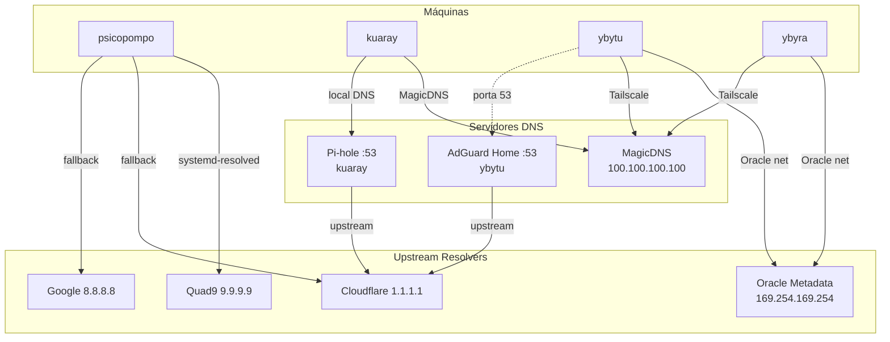

# DNS

Cadeia de resolução de nomes no homelab.

## Visão Geral



## Por Máquina

### Psicopompo
| Item | Valor |
|---|---|
| Resolvedor | systemd-resolved |
| Modo | `stub` (resolv.conf → `/run/systemd/resolve/stub-resolv.conf`) |
| Fallback | Quad9 → Cloudflare → Google |
| Tailscale MagicDNS | ✅ Configurado via systemd-resolved (`100.100.100.100`) |

> **Fix resolve-nm (21/09/2026):** NetworkManager passou a usar `dns=systemd-resolved`
> (em `[main]` do `/etc/NetworkManager/NetworkManager.conf`) e o `/etc/resolv.conf`
> virou symlink para o stub do systemd-resolved (era `foreign`). Isso resolveu o
> aviso do Tailscale `tailscale.com/s/resolve-nm` e habilitou o MagicDNS
> (`*.chimaera-heptatonic.ts.net` resolve via `100.100.100.100`).

### Kuaray
| Item | Valor |
|---|---|
| Resolvedor | Tailscale MagicDNS (`100.100.100.100`) |
| DNS Local | Pi-hole na porta 53 (para dispositivos LAN) |
| Upstream | Cloudflare (configurado no Pi-hole) |

### Ybytu
| Item | Valor |
|---|---|
| Resolvedor | Oracle Metadata DNS (`169.254.169.254`) + MagicDNS |
| DNS Local | AdGuard Home na porta 53 |
| Upstream | Cloudflare (configurado no AdGuard) |

### Ybyra
| Item | Valor |
|---|---|
| Resolvedor | Oracle Metadata DNS (`169.254.169.254`) + MagicDNS |
| DNS Local | Nenhum (sem servidor DNS local) |
| Upstream | Oracle Metadata → Cloudflare |

> **Fix MagicDNS (21/09/2026):** `tailscale set --accept-dns=true` estava com
> `CorpDNS: false` (MagicDNS não injetava no systemd-resolved — `getent` retornava
> vazio apesar de `dig @100.100.100.100` funcionar). Após habilitar:
> `resolvectl status tailscale0` mostra `Current Scopes: DNS` + `DNS Domain:
> chimaera-heptatonic.ts.net` e `getent hosts kuaray...` resolve corretamente.

## Domínios

| Domínio | Resolvido por |
|---|---|
| `*.chimaera-heptatonic.ts.net` | Tailscale MagicDNS |
| `ybytuvcn.oraclevcn.com` | Oracle DNS |
| `ybyravcn.oraclevcn.com` | Oracle DNS |
| Nomes locais LAN | Pi-hole (kuaray) / AdGuard (ybytu) |
| Internet geral | Cloudflare via Pi-hole ou AdGuard |

## Comandos Úteis

```bash
# Ver resolução de um nome
resolvectl query servico.chimaera-heptatonic.ts.net

# Ver servidores DNS configurados
resolvectl status

# Testar DNS por servidor específico
dig @100.100.100.100 psicopompo.chimaera-heptatonic.ts.net
dig @192.168.3.53 google.com
dig @100.115.253.109 google.com
```
