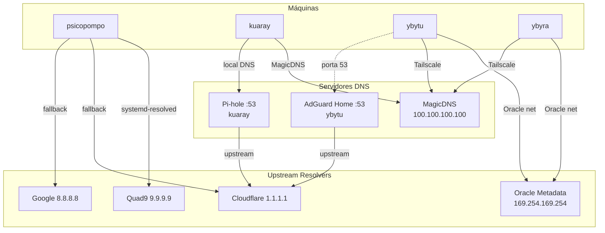

# DNS

Name resolution chain in the homelab.

## Overview



## Per Machine

### Psicopompo
| Item | Value |
|---|---|
| Resolver | systemd-resolved |
| Mode | `stub` (resolv.conf → `/run/systemd/resolve/stub-resolv.conf`) |
| Fallback | Quad9 → Cloudflare → Google |
| Tailscale MagicDNS | ✅ Configured via systemd-resolved (`100.100.100.100`) |

> **Fix resolve-nm (21/09/2026):** NetworkManager now uses `dns=systemd-resolved`
> (in `[main]` of `/etc/NetworkManager/NetworkManager.conf`) and `/etc/resolv.conf`
> became a symlink to the systemd-resolved stub (it was `foreign`). This fixed the
> Tailscale `tailscale.com/s/resolve-nm` warning and enabled MagicDNS
> (`*.chimaera-heptatonic.ts.net` resolves via `100.100.100.100`).

### Kuaray
| Item | Value |
|---|---|
| Resolver | Tailscale MagicDNS (`100.100.100.100`) |
| Local DNS | Pi-hole on port 53 (for LAN devices) |
| Upstream | Cloudflare (configured in Pi-hole) |

### Ybytu
| Item | Value |
|---|---|
| Resolver | Oracle Metadata DNS (`169.254.169.254`) + MagicDNS |
| Local DNS | AdGuard Home on port 53 |
| Upstream | Cloudflare (configured in AdGuard) |

### Ybyra
| Item | Value |
|---|---|
| Resolver | Oracle Metadata DNS (`169.254.169.254`) + MagicDNS |
| Local DNS | None (no local DNS server) |
| Upstream | Oracle Metadata → Cloudflare |

> **Fix MagicDNS (21/09/2026):** `tailscale set --accept-dns=true` was set with
> `CorpDNS: false` (MagicDNS did not inject into systemd-resolved — `getent` returned
> empty even though `dig @100.100.100.100` worked). After enabling it,
> `resolvectl status tailscale0` shows `Current Scopes: DNS` + `DNS Domain:
> chimaera-heptatonic.ts.net` and `getent hosts kuaray...` resolves correctly.

## Domains

| Domain | Resolved by |
|---|---|
| `*.chimaera-heptatonic.ts.net` | Tailscale MagicDNS |
| `ybytuvcn.oraclevcn.com` | Oracle DNS |
| `ybyravcn.oraclevcn.com` | Oracle DNS |
| LAN local names | Pi-hole (kuaray) / AdGuard (ybytu) |
| General Internet | Cloudflare via Pi-hole or AdGuard |

## Useful Commands

```bash
# Ver resolução de um nome
resolvectl query servico.chimaera-heptatonic.ts.net

# Ver servidores DNS configurados
resolvectl status

# Testar DNS por servidor específico
dig @100.100.100.100 psicopompo.chimaera-heptatonic.ts.net
dig @192.168.3.53 google.com
dig @100.115.253.109 google.com
```
