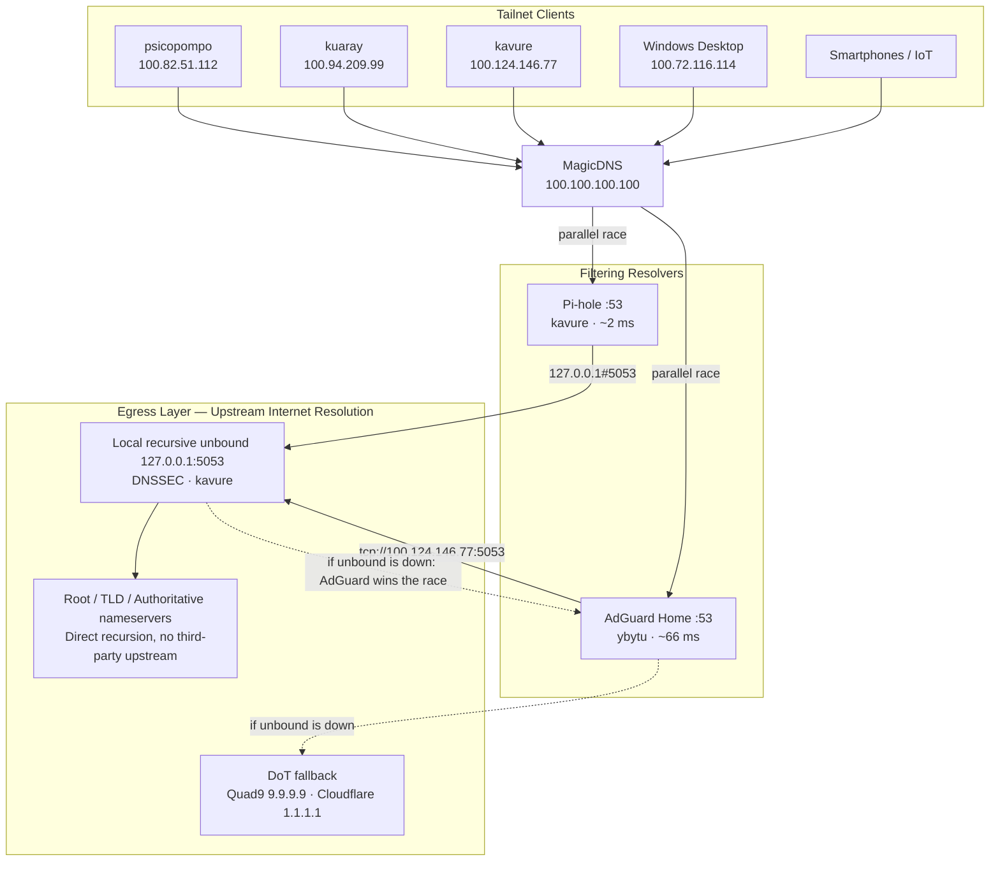

# DNS

Domain name resolution architecture across the homelab ecosystem.

## Overview

Two DNS filtering servers serve the entire tailnet via Tailscale:


```mermaid
graph TB
    subgraph clients[Tailnet Clients]
        psicopompo[psicopompo<br>100.82.51.112]
        kuaray[kuaray<br>100.94.209.99]
        kavure[kavure<br>100.124.146.77]
        desktop[Windows Desktop<br>100.72.116.114]
        mobile[Smartphones / IoT]
    end

    quad100[MagicDNS<br>100.100.100.100]

    subgraph resolvers[Filtering Resolvers]
        pihole[Pi-hole :53<br>kavure · ~2 ms]
        adguard[AdGuard Home :53<br>ybytu · ~66 ms]
    end

    subgraph egress[Egress Layer — Upstream Internet Resolution]
        unbound[Local recursive unbound 127.0.0.1:5053<br>DNSSEC · kavure]
        roots[Root / TLD / Authoritative nameservers<br>Direct recursion, no third-party upstream]
        dot[DoT fallback<br>Quad9 9.9.9.9 · Cloudflare 1.1.1.1]
    end

    psicopompo --> quad100
    kuaray --> quad100
    kavure --> quad100
    desktop --> quad100
    mobile --> quad100

    quad100 -->|parallel race| pihole
    quad100 -->|parallel race| adguard

    pihole -->|"127.0.0.1#5053"| unbound
    unbound --> roots

    adguard -->|"tcp://100.124.146.77:5053"| unbound
    adguard -.->|if unbound is down| dot
    unbound -.->|if unbound is down: AdGuard wins the race| adguard
```

## How Tailscale Dispatches Between the Two Resolvers (Benchmarked 2026-10-06, Reconfirmed 2026-10-08)

The **nameserver order in the Tailscale admin console does NOT establish primary/secondary priority**.
The local Tailscale forwarder (`100.100.100.100` / Quad100) dispatches **every query to both resolvers in parallel and consumes whichever response arrives first** (as documented in [tailscale/tailscale#19024](https://github.com/tailscale/tailscale/issues/19024): *"the forwarder races them in parallel"*):

| Attribute | Pi-hole (kavure) | AdGuard (ybytu) |
|---|---|---|
| Latency (warm cache) | **~2 ms** (Gigabit LAN + local cache) | **~66 ms** (Oracle Cloud + tailnet transit) |
| Wins when **both** have the record cached | ✅ (2 ms ≪ 66 ms) | — |
| Wins when **only AdGuard** has it cached | — (~290 ms: cold recursion) | ✅ (35–92 ms) |
| Actual operational role | Resolves the **vast majority** of queries (warm hits) | **Active parallel peer (not just failover)**: wins whenever AdGuard has a warm cache and Pi-hole has a cold miss |

**Evidence of parallel duplicate dispatching (packet capture on ybytu `tailscale0`, 2026-10-06; reconfirmed 2026-10-08):**
The exact same queries forwarded via `100.100.100.100` appeared **in both Pi-hole (FTL log) and AdGuard logs simultaneously** — both nodes receive every query; the faster node simply wins. Reconfirmed on 2026-10-08 with a **probe query for an unprecedented domain name**: it was registered in Pi-hole FTL (forwarded) **and** in the AdGuard query log.
Therefore, similar query volumes between nodes do not indicate equal load distribution, but rather concurrent dual-dispatching. AdGuard also receives direct traffic from select host devices (top clients: Docker bridge `172.22.0.1`, `100.115.253.109`, `127.0.0.1`).

> ⚠️ **The assumption that "Pi-hole always wins / serves as the default decider" is FALSE (empirical measurement 2026-10-08).**  
> Race test from psicopompo → `100.100.100.100`, 25 popular domains, 1 query each:  
> - **7** fast responses (2–22 ms → Pi-hole cache hit)  
> - **8** medium responses (35–92 ms → AdGuard cache hit)  
> - **10** cold responses (>150 ms, first-time full recursive lookup)  
> The race is decided entirely by **latency**, and latency is dictated by **cache locality**: when both have the record cached, Pi-hole wins decisively (2 ms ≪ 66 ms); when only AdGuard has it cached, AdGuard wins. **There is no fixed winner** — both resolvers require strict rule parity.

> **Practical operational impact (why blocklist parity matters):**  
> Whichever resolver answers first applies **its own local blocklists**. If filter rules diverge, domain blocking becomes non-deterministic — a domain blocked only on Pi-hole will leak through whenever AdGuard wins the race.  
> Consequently, both nodes maintain an identical set of exact denylists, telemetry rules, and localized block filters since 2026-10-06 (see [`services/pihole.md`](../services/pihole.md) and [`services/adguard-home.md`](../services/adguard-home.md)).  
> **Parity audit measured on 2026-10-08:** Pi-hole **43.2%** blocked × AdGuard **44.0%** blocked ✅.

**Query volumes recorded:** Pi-hole **85,799 queries / 24h** (2026-10-08) · AdGuard **~79,000 / day** (~2-day log: 158,431 queries). Historical Pi-hole volume from 2026-08-09 to 2026-10-06: 5.08 M queries. Top clients: `100.72.116.114` (Windows Desktop) 1.46 M · kavure 1.38 M · psicopompo 1.03 M · kuaray 332 k · ybytu 325 k.

## Egress Layer — Local Recursive Unbound (2026-10-08)

The **filter layer** (Pi-hole / AdGuard) decides what to block; the **egress layer** decides who inspects the query.
Since **2026-10-08**, egress from kavure is **fully local recursive** (native `unbound` daemon listening on port 5053):

| Resolver | Egress Mode | ISP Visibility | Third-Party Upstream Visibility |
|---|---|---|---|
| Pi-hole (kavure) | Local `unbound` → **direct root recursion** (Root → TLD → Authoritative nameserver) | Partial — ISP observes outbound UDP/TCP port 53 traffic, but queries are distributed directly to authoritative servers rather than a single upstream DNS provider | ✅ Complete — No upstream resolver (Google, Cloudflare, Quad9) sees user lookup history |
| AdGuard (ybytu) | `tcp://100.124.146.77:5053` → **the same kavure unbound instance** · fallback `tls://9.9.9.9` / `tls://1.1.1.1` (DoT) | Partial (same transit path) | ✅ Full privacy; during fallback events, traffic is encrypted via DoT to Quad9/Cloudflare |
| Hosts (systemd-resolved) | Global fallback `9.9.9.9` / `1.1.1.1` with `DNSOverTLS=opportunistic` | ✅ Encrypted when active | Partial (DoT upstream inspection) |

> **Architecture decision 2026-10-08:**  
> The previous anonymized chain (Anonymized DNSCrypt routing through US-East CryptoStorm relays) introduced **353 ms cold latency** per query due to transatlantic round-trips with **no South American relay nodes available**, severely degrading interactive browsing responsiveness.  
> Chosen design: **fluent browsing latency prioritized over absolute anonymity**. Unbound eliminates all commercial upstream resolvers (self-hosted recursion with native DNSSEC validation) while accepting generic authoritative lookups visible to the ISP. Detailed benchmark data and image comparisons: [`services/unbound.md`](../services/unbound.md).

### Resilience & Failover Proofs (Re-verified 2026-10-08)

| Simulated Failure Scenario | System Behavior & Measured Result |
|---|---|
| **kavure `unbound` daemon stopped (2026-10-08)** | Queries forwarded via `100.100.100.100` resolved cleanly in **131 / 87 ms** (AdGuard smoothly fell back to its encrypted DoT upstreams) → **zero internet outage**. Unbound restored and normalized ✅ |
| kavure `dnscrypt-proxy` stopped (historical test 2026-10-06) | Pi-hole stopped responding; tailnet queries via `100.100.100.100` continued resolving within 60 ms via AdGuard DoT fallback → zero outage |
| ybytu `dnscrypt-proxy` stopped | AdGuard degraded gracefully to secondary fallback within ~197 ms |
| Pi-hole configured with `strict-order` + flat upstream fallback | **Failed to failover** (6 consecutive upstream timeouts) → architecture permanently rejected |

> **Key Architectural Insight:**  
> DNS redundancy in this environment is provided by the **parallel race between independent filtering resolvers**, not by upstream sequential lists inside dnsmasq. Flat fallbacks inside Pi-hole either **leak unfiltered queries** (without `strict-order`) or **hang during outages** (with `strict-order`).

## Three-Tier Caching Architecture (Measured 2026-10-07, Tuned 2026-10-08)

| Tier | Host Node | Allocation / Settings | Operational Status |
|---|---|---|---|
| **unbound** | kavure | `msg-cache 128m` · `rrset-cache 256m` · `key-cache 64m` · `neg-cache 16m` · `prefetch: yes` + `prefetch-key: yes` + `serve-expired: yes` (24h TTL tolerance, v2 tuning) · 2 threads | Succeeded the historical dnscrypt cache on 2026-10-08; metrics monitored via `unbound-control stats_noreset` (⚠️ running `stats` without `noreset` resets internal counters; watchdog logs telemetry every 2 minutes) |
| **Pi-hole (FTL)** | kavure | `dns.cache.size = 10000` · `optimizer = 3600` (serve-stale) | **0 evictions** across 22,422 insertions · **~82% hit rate** (33,312 hits / 7,516 misses) |
| **AdGuard** | ybytu | `cache_size = 4194304` (4 MiB default) · `cache_ttl_min/max = 0` (preserves upstream TTL) | Healthy |

**Available memory headroom:** kavure has ~6.3 GB free RAM, and both DNS resolvers combined consume less than 60 MB RSS. However, official [Pi-hole FTL documentation](https://docs.pi-hole.net/ftldns/dns-cache) explicitly notes: *"there is no benefit in increasing this number unless cache evictions are greater than zero"* — and lookup hash efficiency degrades beyond 10,000 entries. Since evictions remain at **zero**, Pi-hole cache allocation is optimal. AdGuard cache remains conservatively sized due to ybytu's constrained memory footprint (~270 MB free).

> To inspect active Pi-hole cache metrics on kavure at any time:  
> `dig +short chaos txt {cachesize,insertions,evictions,hits,misses}.bind @127.0.0.1`

## Node Profiles

### Psicopompo
| Component | Configuration |
|---|---|
| Local Resolver | systemd-resolved (`stub` mode → `/run/systemd/resolve/stub-resolv.conf`) |
| Tailnet DNS | `100.100.100.100` (Quad100) — scope `~.` (default routing domain) |
| Fallback | Quad9 `9.9.9.9` → Cloudflare `1.1.1.1` (Opportunistic DoT, **no Google DNS**) — active only if Tailscale drops |

> **NetworkManager Integration Fix (2026-09-21):**  
> NetworkManager was configured with `dns=systemd-resolved` (under `[main]` in `/etc/NetworkManager/NetworkManager.conf`) and `/etc/resolv.conf` was established as a direct symlink to the systemd-resolved stub file. This resolved the Tailscale `tailscale.com/s/resolve-nm` routing alert and enabled reliable MagicDNS resolution (`*.chimaera-heptatonic.ts.net` resolves via `100.100.100.100`).

### Kavure
| Component | Configuration |
|---|---|
| Server Software | **Pi-hole** (Docker container `pihole`, `network_mode: host`, bound exclusively to `tailscale0`) |
| Service Ports | Port `53` (DNS) · Admin console `http://100.124.146.77/admin` |
| Upstream Target | `127.0.0.1#5053` → **local recursive unbound instance** (DNSSEC enabled since 2026-10-08 — [`services/unbound.md`](../services/unbound.md)) |
| Operational Role | Primary low-latency resolver in the parallel tailnet race (**non-exclusive** — see benchmark notes above) |

### Ybytu
| Component | Configuration |
|---|---|
| Server Software | **AdGuard Home** (Docker container `adguardhome`) |
| Service Ports | Port `53` (DNS) · Admin console `http://ybytu.chimaera-heptatonic.ts.net:3000` |
| Upstream Target | `tcp://100.124.146.77:5053` → **kavure recursive unbound endpoint** · DoT fallback `tls://9.9.9.9` / `tls://1.1.1.1` |
| Operational Role | **Parallel peer resolver & automatic failover target** for Pi-hole and direct client endpoints |
| Memory Tuning | Memory limit 954 MB RAM — querylog set to `7d` retention with `size_memory: 200` since 2026-10-06 (preventing past 4 GB OOM issues) |

### Kuaray
| Component | Configuration |
|---|---|
| Resolver | Tailscale MagicDNS (`100.100.100.100`) |
| Local DNS Server | **None** — Pi-hole was historically hosted on this node and migrated to kavure on 2026-08-09 |

### Ybyra
| Component | Configuration |
|---|---|
| Resolver | Oracle Metadata DNS (`169.254.169.254`) + Tailscale MagicDNS |
| Local DNS Server | None |

> **MagicDNS Route Fix (2026-09-21):**  
> `tailscale set --accept-dns=true` was previously defaulting to `CorpDNS: false` (preventing MagicDNS injection into systemd-resolved, causing `getent` lookups to fail despite working `dig @100.100.100.100` tests). After enabling CorpDNS: `resolvectl status tailscale0` reports `Current Scopes: DNS` with `DNS Domain: chimaera-heptatonic.ts.net`, restoring local hostname resolution.

## Domain Namespace Routing

| Domain Namespace | Handled By |
|---|---|
| `*.chimaera-heptatonic.ts.net` | Tailscale MagicDNS |
| `ybytuvcn.oraclevcn.com` | Oracle VCN Internal DNS |
| `ybyravcn.oraclevcn.com` | Oracle VCN Internal DNS |
| Local LAN Hostnames | Pi-hole (kavure) / AdGuard (ybytu) |
| Public Internet Domains | Upstream authority resolved by whichever filtering peer wins the parallel race |

## Resolver Parity Verification Commands

```bash
# Verify record consistency across both resolvers simultaneously:
for d in telemetry.microsoft.com ge.globo.com www.google.com; do
  printf '%-35s pihole=%s adguard=%s\n' "$d" \
    "$(dig +short A "$d" @100.124.146.77 | head -1)" \
    "$(dig +short A "$d" @100.115.253.109 | head -1)"
done

# Audit which resolver recently processed local queries:
ssh root@100.124.146.77 "sqlite3 /srv/data/pihole/etc-pihole/pihole-FTL.db \
  \"SELECT domain,client,status FROM queries ORDER BY timestamp DESC LIMIT 10;\""

# Validate concurrent parallel query dispatching across Tailscale:
ssh root@100.115.253.109 'timeout 15 tcpdump -nntt -i any \
  "udp port 53 and src net 100.64.0.0/10" -c 20'
```

## Useful Operational Commands

```bash
# Query active name resolution status for a given service:
resolvectl query servico.chimaera-heptatonic.ts.net

# Inspect configured DNS nameservers:
resolvectl status
tailscale dns status

# Test resolution directly against specific endpoints:
dig @100.100.100.100 google.com        # Quad100 (Tailscale forwarder)
dig @100.124.146.77 google.com         # Pi-hole (kavure)
dig @100.115.253.109 google.com        # AdGuard (ybytu)
```
