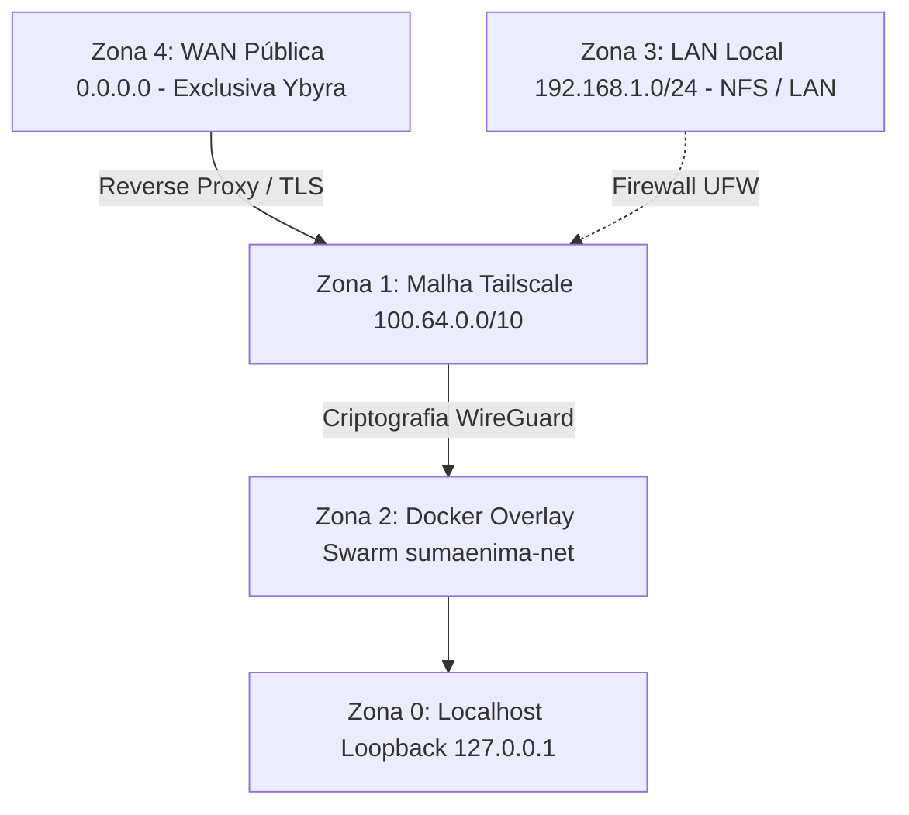

# Canonical Port Catalog & Attack Surface (Mnemocine Homelab)

> **Status:** Canonical and auditable by the Stênio Sentinel (`stenio --ports`)  
> **Security Philosophy:** Zero Trust & Defense in Depth. Every open port MUST have an explicit justification, a restricted interface, and a direct link to the documentation.

---

## 1. Trust Zones & Bind Guidelines

The homelab follows a strict network segregation policy. No application should listen outside its authorized zone:

| Zone | Interface / Subnet | Allowed Exposure | Authorized Services |
|---|---|---|---|
| **Zone 0: Loopback** | `127.0.0.1`, `::1` | Isolated on the local host | Docker Daemon (`2375`), IPC sockets, temporary local dev |
| **Zone 1: Tailnet** | `100.64.0.0/10` (`tailscale0`) | Private and encrypted (WireGuard) | **Mandatory default channel** for 95% of homelab services |
| **Zone 2: Swarm Overlay** | `sumaenima_sumaenima-net` | Microservices and GPU workers | Inter-container communication (API ↔ Valkey ↔ StênioREC) |
| **Zone 3: Local LAN** | `192.168.1.0/24` (eth0/wlan0) | Restricted to the house wired/Wi-Fi network | NFSv4 (`2049`), Syncthing sync (`22000`), KDE Connect (`1716`) |
| **Zone 4: Public WAN** | `0.0.0.0` (open Internet) | **STRICTLY RESTRICTED** | Only ports 80/443 on the `ybyra` edge node |

> [!CAUTION]
> **Ban on `0.0.0.0` on internal nodes:** It is strictly forbidden to bind internal services (such as databases, inference APIs, or admin panels) to `0.0.0.0`. If the service needs to be reachable from another node, use the Tailscale IP (`100.x.y.z`) or the `tailscale0` interface.

---

## 2. Canonical Port Matrix per Node

### 2.1. Psicopompo (`100.82.51.112`) — Dev, GPU Worker & NAS

| Port / Proto | Bind / Interface | Service | Technical Justification | Canonical Documentation |
|---|---|---|---|---|
| `9090/tcp` | `127.0.0.1` + `100.82.51.112` | **`steniorec`** (Axum/Whisper) | GPU inference for audio transcription and STT streaming | [`service-topology.md`](service-topology.md) |
| `8384/tcp` | `127.0.0.1` + `100.82.51.112` | **Syncthing Web** | Vault sync admin interface | [`../backups/`](../backups/) |
| `22000/tcp,udp` | LAN + `tailscale0` | **Syncthing Protocol** | Encrypted mTLS data transfer between nodes | [`../backups/`](../backups/) |
| `2049/tcp` | `100.82.51.112` / `tailscale0` | **NFSv4 Server** | Secure NAS share `/mnt/BACKUP` (WireGuard) | [`nfs.md`](nfs.md) |
| `111/tcp,udp` | LAN | **rpcbind** | RPC mapping for legacy/v3 NFS mounts | [`nfs.md`](nfs.md) |
| `20048/tcp,udp` | LAN | **rpc.mountd** | NFS mount daemon | [`nfs.md`](nfs.md) |
| `61208/tcp` | `127.0.0.1` + `100.82.51.112` | **Glances** | CPU/RAM/GPU telemetry and local metrics | [`service-topology.md`](service-topology.md) |
| `9100/tcp` | `100.82.51.112` / `tailscale0` | **Node Exporter** | Prometheus collection of OS metrics | [`../services/`](../services/) |
| `9080/tcp` | `127.0.0.1` (Localhost) | **Promtail** | Loki log agent (HTTP/health endpoint) | [`../services/`](../services/) |
| `9096/tcp` | `100.82.51.112` / `tailscale0` | **wol-relay** | Wake-on-LAN daemon for remote trigger via Homepage | [`service-topology.md`](service-topology.md) |
| `9092/tcp` | `0.0.0.0` (Swarm Ingress) | **Swarm Ingress Mesh** | Dynamic multi-host routing of cluster services | [`../services/`](../services/) |
| `7946/tcp,udp` | `tailscale0` (filtered via UFW) | **Docker Swarm Gossip** | Distributed control plane of the Swarm cluster | [`../services/`](../services/) |
| `4789/udp` | `100.82.51.112` / `tailscale0` | **Docker VXLAN Overlay** | Network encapsulation for Swarm containers | [`../services/`](../services/) |
| `2375/tcp` | `127.0.0.1` + `100.82.51.112` | **docker-socket-proxy** | Secure proxy with restricted permissions on the Docker API (Homepage) | [`service-topology.md`](service-topology.md) |
| `1716/tcp,udp` | LAN (local Wi-Fi) | **KDE Connect** | Mobile integration with the operator's smartphone | Desktop use |

---

### 2.2. Kavure (`100.124.146.77`) — Swarm Manager & Core Services

| Port / Proto | Bind / Interface | Service | Technical Justification | Canonical Documentation |
|---|---|---|---|---|
| `9090/tcp` | `100.124.146.77` / `tailscale0` | **sae-core_api** | Sumænimá Hub Core REST & Websocket API | [`../services/`](../services/) |
| `5432/tcp` | `100.124.146.77` / `tailscale0` | **PostgreSQL (sae-core_db)** | Persistent SQLx relational database | [`../services/`](../services/) |
| `6379/tcp` | `100.124.146.77` / `tailscale0` | **Valkey (sae-core_valkey)** | Pub/Sub event bus and in-memory cache | [`../services/`](../services/) |
| `2377/tcp` | `100.124.146.77` / `tailscale0` | **Swarm Manager** | Management and orchestration of the Docker Swarm cluster | [`../services/`](../services/) |
| `7946/tcp,udp` | `100.124.146.77` / `tailscale0` | **Swarm Gossip** | Discovery and heartbeat between cluster nodes | [`../services/`](../services/) |
| `4789/udp` | `100.124.146.77` / `tailscale0` | **Swarm VXLAN** | Overlay network for direct container communication | [`../services/`](../services/) |
| `9092/tcp` | `100.124.146.77` / `tailscale0` | **backup-sentinel & Swarm Ingress** | Backup health check and Swarm routing | [`../services/`](../services/) |
| `9100/tcp` | `100.124.146.77` / `tailscale0` | **Node Exporter** | Metrics exporter for the Kavure host | [`../services/`](../services/) |
| `61208/tcp` | `100.124.146.77` / `tailscale0` | **Glances** | Host telemetry (CPU/RAM/disk) | [`service-topology.md`](service-topology.md) |
| `2375/tcp` | `100.124.146.77` / `tailscale0` | **docker-socket-proxy** | Docker proxy monitored by Homepage | [`../services/homepage.md`](../services/homepage.md) |
| `3000/tcp` | `100.124.146.77` / `tailscale0` | **AioStreams** | Stream aggregation server | [`../services/aiostreams.md`](../services/aiostreams.md) |
| `3001/tcp` | `100.124.146.77` / `tailscale0` | **Zomboid Control Panel** | Web management panel for the Project Zomboid server | [`../servers/kavure.md`](../servers/kavure.md) |
| `3002/tcp` | `100.124.146.77` / `tailscale0` | **Grafana** | Observability and metrics dashboards | [`../services/`](../services/) |
| `3003/tcp` | `100.124.146.77` / `tailscale0` | **Miracena Nuxt** | Web frontend of the Miracena project | [`../servers/kavure.md`](../servers/kavure.md) |
| `3100/tcp` | `100.124.146.77` / `tailscale0` | **Loki** | Central log collector and indexer for the homelab | [`../services/`](../services/) |
| `4533/tcp` | `100.124.146.77` / `tailscale0` | **Navidrome** | Personal audio streaming server | [`../servers/kavure.md`](../servers/kavure.md) |
| `5678/tcp` | `100.124.146.77` / `tailscale0` | **n8n** | Workflow automation platform | [`../servers/kavure.md`](../servers/kavure.md) |
| `8000/tcp` | `100.124.146.77` / `tailscale0` | **Comet** | Stremio addon and indexer | [`../services/comet.md`](../services/comet.md) |
| `8055/tcp` | `100.124.146.77` / `tailscale0` | **Directus** | Headless CMS and API for the ecosystem | [`../servers/kavure.md`](../servers/kavure.md) |
| `8080/tcp` | `100.124.146.77` / `tailscale0` | **SearXNG Core** | Private metasearch, tracking-free | [`../servers/kavure.md`](../servers/kavure.md) |
| `8083/tcp` | `100.124.146.77` / `tailscale0` | **Calibre Web** | Digital library and e-book reader | [`../services/calibre-web.md`](../services/calibre-web.md) |
| `8085/tcp` | `100.124.146.77` / `tailscale0` | **Miracena WordPress** | Miracena web CMS | [`../servers/kavure.md`](../servers/kavure.md) |
| `8123/tcp` | `100.124.146.77` / `tailscale0` | **Home Assistant** | Home automation and IoT dashboards | [`../services/home-assistant.md`](../services/home-assistant.md) |
| `8444/tcp` | `100.124.146.77` / `tailscale0` | **Crafty Controller** | Management panel for the Minecraft server | [`../services/crafty.md`](../services/crafty.md) |
| `8766/tcp` | `100.124.146.77` / `tailscale0` | **sae-core_asciline** | Hub Asciiline terminal interface | [`../services/`](../services/) |
| `9091/tcp` | `100.124.146.77` / `tailscale0` | **Prometheus** | Monitoring time-series database | [`../services/`](../services/) |
| `9093/tcp` | `100.124.146.77` / `tailscale0` | **Alertmanager** | Alert and notification router | [`../services/`](../services/) |
| `25565/tcp` | LAN + `tailscale0` | **Minecraft Dominium** | Minecraft Dominium game server | [`../services/crafty.md`](../services/crafty.md) |

---

### 2.3. Ybyra (`100.66.224.34`) — Primary Cloud Edge (DMZ / Edge)

| Port / Proto | Bind / Interface | Service | Technical Justification | Canonical Documentation |
|---|---|---|---|---|
| `80/tcp` | `0.0.0.0` (Public WAN) | **Nginx Reverse Proxy** | Public HTTP (permanent redirect to HTTPS) | [`topology.md`](topology.md) |
| `443/tcp` | `0.0.0.0` (Public WAN) | **Nginx Reverse Proxy** | TLS termination (Certbot / Let's Encrypt) and reverse proxy | [`topology.md`](topology.md) |
| `2375/tcp` | `100.66.224.34` / `tailscale0` | **docker-socket-proxy** | Docker telemetry for Homepage via Tailnet | [`../services/homepage.md`](../services/homepage.md) |
| `9100/tcp` | `100.66.224.34` / `tailscale0` | **Node Exporter** | Edge metrics consumed by Prometheus via Tailnet | [`../services/`](../services/) |
| `61208/tcp` | `100.66.224.34` / `tailscale0` | **Glances** | Edge server telemetry | [`service-topology.md`](service-topology.md) |
| `9092/tcp` | `tailscale0` (Swarm Ingress) | **Swarm Ingress Mesh** | Dynamic cluster edge routing | [`../services/`](../services/) |
| `7946/tcp,udp` | `tailscale0` | **Swarm Gossip** | Heartbeat and cluster communication | [`../services/`](../services/) |

---

### 2.4. Ybytu (`100.115.253.109`) — Cloud Exit Node & DNS Infra

| Port / Proto | Bind / Interface | Service | Technical Justification | Canonical Documentation |
|---|---|---|---|---|
| `53/udp,tcp` | `tailscale0` | **AdGuard Home** | Primary homelab DNS with telemetry blocking | [`dns.md`](dns.md) |
| `3000/tcp` | `tailscale0` | **AdGuard Web** | Control panel and DNS query auditing | [`dns.md`](dns.md) |
| `3001/tcp` | `tailscale0` | **Homepage** | Central service and status dashboard | [`../services/homepage.md`](../services/homepage.md) |
| `3002/tcp` | `tailscale0` | **Uptime Kuma** | Availability monitor for all services and nodes | [`service-topology.md`](service-topology.md) |
| `8082/tcp` | `tailscale0` | **ChangeDetection** | Change monitoring for web pages | [`service-topology.md`](service-topology.md) |
| `8083/tcp` | `tailscale0` | **Ntfy** | Push notification server for incidents and alerts | [`service-topology.md`](service-topology.md) |
| `9100/tcp` | `tailscale0` | **Node Exporter** | Metrics exporter for the Ybytu host | [`../services/`](../services/) |
| `61208/tcp` | `tailscale0` | **Glances** | Ybytu host telemetry | [`service-topology.md`](service-topology.md) |

---

### 2.5. Kuaray (`100.94.209.99`) — Media & Automation Server

| Port / Proto | Bind / Interface | Service | Technical Justification | Canonical Documentation |
|---|---|---|---|---|
| `2375/tcp` | `100.94.209.99` / `tailscale0` | **docker-socket-proxy** | Docker proxy queried by Homepage | [`../services/homepage.md`](../services/homepage.md) |
| `8384/tcp` | `127.0.0.1` + `tailscale0` | **Syncthing Web** | Sync admin interface | [`../backups/`](../backups/) |
| `22000/tcp,udp` | LAN + `tailscale0` | **Syncthing Protocol** | Vault sync traffic on Kuaray | [`../backups/`](../backups/) |
| `9100/tcp` | `tailscale0` | **Node Exporter** | Metrics exporter for the Kuaray host | [`../services/`](../services/) |
| `61208/tcp` | `tailscale0` | **Glances** | CPU/RAM and disk telemetry for Kuaray | [`service-topology.md`](service-topology.md) |
| `9696/tcp` | `tailscale0` | **Prowlarr** | Manager and integrator for torrent indexers | [`../servers/kuaray.md`](../servers/kuaray.md) |
| `8686/tcp` | `tailscale0` | **Lidarr** | Music library manager | [`../services/lidarr.md`](../services/lidarr.md) |
| `8191/tcp` | `tailscale0` | **Flaresolverr** | Cloudflare protection bypass for automations | [`../services/flaresolverr.md`](../services/flaresolverr.md) |
| `9091/tcp` | `tailscale0` | **Transmission RPC** | Control interface for torrent downloads | [`../servers/kuaray.md`](../servers/kuaray.md) |
| `51413/tcp` | LAN + `tailscale0` | **Transmission Peer** | P2P torrent transfer port | [`../servers/kuaray.md`](../servers/kuaray.md) |
| `139,445/tcp` | LAN | **Samba (smbd)** | File sharing on the local network | [`../servers/kuaray.md`](../servers/kuaray.md) |

---

## 3. The Role of the Stênio Sentinel as Port Guardian

The Stênio runs compliance audits against this catalog:

1. **Local Active Scan (`stenio --ports`):**
   - Inspects the TCP/UDP sockets listening on the local host at runtime via `/proc/net/tcp` (<2ms).
   - Compares each port against this catalog.
   - **Authorized Port:** Identified with a service and canonical link.
   - **Orphan / Undocumented Port:** Yellow alert with a recommendation to register it or kill the process.
   - **Insecure Bind (`0.0.0.0`):** Red alert with a security violation (`SEC-PORT-EXPOSURE`).

2. **Tailscale Mesh Audit (Multi-Node Probing):**
   - Through asynchronous TCP connections via `tokio::net::TcpStream`, the Stênio tests whether remote nodes respond only on authorized ports.
   - Measures latency and validates firewall isolation (UFW).
