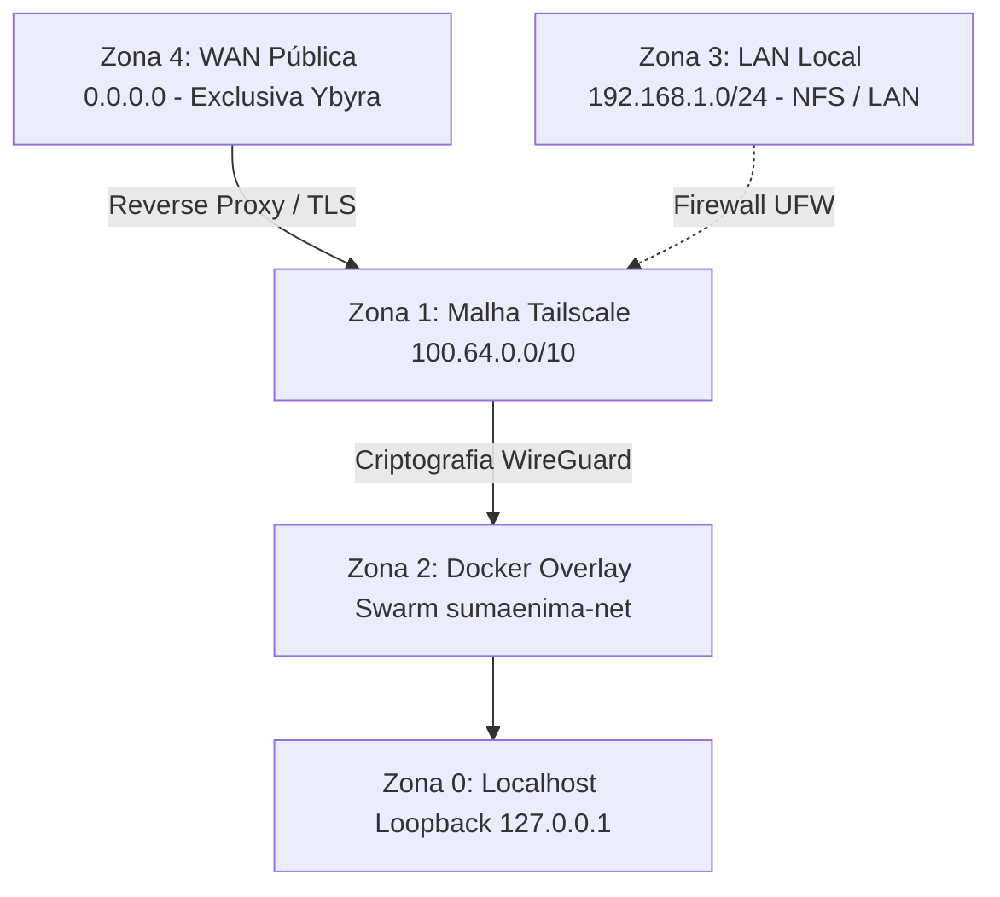

# Catálogo Canônico de Portas & Superfície de Ataque (Mnemocine Homelab)

> **Status:** Canônico e Auditável pelo Stênio Sentinel (`stenio --ports`)  
> **Filosofia de Segurança:** Zero Trust & Defense in Depth. Toda porta aberta DEVE ter justificativa explícita, interface restrita e vínculo direto com a documentação.

---

## 1. Zonas de Confiança & Diretrizes de Bind

O homelab adota a política de segregação estrita de rede. Nenhuma aplicação deve escutar fora da sua zona autorizada:

| Zona | Interface / Sub-rede | Exposição Permitida | Serviços Autorizados |
|---|---|---|---|
| **Zona 0: Loopback** | `127.0.0.1`, `::1` | Isolada no host local | Docker Daemon (`2375`), Sockets IPC, dev local temporário |
| **Zona 1: Tailnet** | `100.64.0.0/10` (`tailscale0`) | Privada e criptografada (WireGuard) | **Canal padrão obrigatório** para 95% dos serviços do homelab |
| **Zona 2: Swarm Overlay** | `sumaenima_sumaenima-net` | Microsserviços e GPU workers | Comunicação inter-container (API ↔ Valkey ↔ StênioREC) |
| **Zona 3: LAN Local** | `192.168.1.0/24` (eth0/wlan0) | Restrita à rede cabeada/Wi-Fi da casa | NFSv4 (`2049`), Syncthing sync (`22000`), KDE Connect (`1716`) |
| **Zona 4: WAN Pública** | `0.0.0.0` (Internet aberta) | **ESTRITAMENTE RESTRITA** | Apenas portas 80/443 no nó de borda `ybyra` |

> [!CAUTION]
> **Proibição de `0.0.0.0` em nós internos:** É estritamente proibido bindar serviços internos (como bancos de dados, APIs de inferência ou painéis de controle) em `0.0.0.0`. Se o serviço precisa ser acessível por outro nó, use o IP Tailscale (`100.x.y.z`) ou a interface `tailscale0`.

---

## 2. Matriz Canônica de Portas por Nó

### 2.1. Psicopompo (`100.82.51.112`) — Dev, GPU Worker & NAS

| Porta / Proto | Bind / Interface | Serviço | Justificativa Técnica | Documentação Canônica |
|---|---|---|---|---|
| `9090/tcp` | `127.0.0.1` + `100.82.51.112` | **`steniorec`** (Axum/Whisper) | Inferência GPU de transcrição de áudio e streaming STT | [`service-topology.md`](service-topology.md) |
| `8384/tcp` | `127.0.0.1` + `100.82.51.112` | **Syncthing Web** | Interface administrativa de sincronização do Vault | [`../backups/`](../backups/) |
| `22000/tcp,udp` | LAN + `tailscale0` | **Syncthing Protocol** | Transferência criptografada mTLS de dados entre nós | [`../backups/`](../backups/) |
| `2049/tcp` | `100.82.51.112` / `tailscale0` | **NFSv4 Server** | Compartilhamento seguro do NAS `/mnt/BACKUP` (WireGuard) | [`nfs.md`](nfs.md) |
| `111/tcp,udp` | LAN | **rpcbind** | Mapeamento RPC para montagens NFS legadas/v3 | [`nfs.md`](nfs.md) |
| `20048/tcp,udp` | LAN | **rpc.mountd** | Daemon de montagem NFS | [`nfs.md`](nfs.md) |
| `61208/tcp` | `127.0.0.1` + `100.82.51.112` | **Glances** | Telemetria de CPU/RAM/GPU e métricas locais | [`service-topology.md`](service-topology.md) |
| `9100/tcp` | `100.82.51.112` / `tailscale0` | **Node Exporter** | Coleta Prometheus de métricas do sistema operacional | [`../services/`](../services/) |
| `9080/tcp` | `127.0.0.1` (Localhost) | **Promtail** | Agente de logs do Loki (endpoint HTTP/health) | [`../services/`](../services/) |
| `9096/tcp` | `100.82.51.112` / `tailscale0` | **wol-relay** | Daemon Wake-on-LAN para acionamento remoto via Homepage | [`service-topology.md`](service-topology.md) |
| `9092/tcp` | `0.0.0.0` (Swarm Ingress) | **Swarm Ingress Mesh** | Roteamento dinâmico multi-host de serviços do cluster | [`../services/`](../services/) |
| `7946/tcp,udp` | `tailscale0` (filtrado via UFW) | **Docker Swarm Gossip** | Plano de controle distribuído do cluster Swarm | [`../services/`](../services/) |
| `4789/udp` | `100.82.51.112` / `tailscale0` | **Docker VXLAN Overlay** | Encapsulamento de rede para containers do Swarm | [`../services/`](../services/) |
| `2375/tcp` | `127.0.0.1` + `100.82.51.112` | **docker-socket-proxy** | Proxy seguro com permissões restritas da API Docker (Homepage) | [`service-topology.md`](service-topology.md) |
| `1716/tcp,udp` | LAN (Wi-Fi local) | **KDE Connect** | Integração móvel com smartphone do operador | Uso desktop |

---

### 2.2. Kavure (`100.124.146.77`) — Swarm Manager & Serviços Core

| Porta / Proto | Bind / Interface | Serviço | Justificativa Técnica | Documentação Canônica |
|---|---|---|---|---|
| `9090/tcp` | `100.124.146.77` / `tailscale0` | **sae-core_api** | API Core REST & Websocket do Sumænimá Hub | [`../services/`](../services/) |
| `5432/tcp` | `100.124.146.77` / `tailscale0` | **PostgreSQL (sae-core_db)** | Banco relacional persistente SQLx | [`../services/`](../services/) |
| `6379/tcp` | `100.124.146.77` / `tailscale0` | **Valkey (sae-core_valkey)** | Barramento Pub/Sub de eventos e cache em memória | [`../services/`](../services/) |
| `2377/tcp` | `100.124.146.77` / `tailscale0` | **Swarm Manager** | Gerenciamento e orquestração do cluster Docker Swarm | [`../services/`](../services/) |
| `7946/tcp,udp` | `100.124.146.77` / `tailscale0` | **Swarm Gossip** | Descoberta e heartbeat entre nós do cluster | [`../services/`](../services/) |
| `4789/udp` | `100.124.146.77` / `tailscale0` | **Swarm VXLAN** | Rede overlay para comunicação direta entre containers | [`../services/`](../services/) |
| `9092/tcp` | `100.124.146.77` / `tailscale0` | **backup-sentinel & Swarm Ingress** | Health check de backup e roteamento Swarm | [`../services/`](../services/) |
| `9100/tcp` | `100.124.146.77` / `tailscale0` | **Node Exporter** | Exportador de métricas do host Kavure | [`../services/`](../services/) |
| `61208/tcp` | `100.124.146.77` / `tailscale0` | **Glances** | Telemetria do host (CPU/RAM/disco) | [`service-topology.md`](service-topology.md) |
| `2375/tcp` | `100.124.146.77` / `tailscale0` | **docker-socket-proxy** | Proxy Docker monitorado pelo Homepage | [`../services/homepage.md`](../services/homepage.md) |
| `3000/tcp` | `100.124.146.77` / `tailscale0` | **AioStreams** | Servidor de agregação de streams | [`../services/aiostreams.md`](../services/aiostreams.md) |
| `3001/tcp` | `100.124.146.77` / `tailscale0` | **Zomboid Control Panel** | Painel web de gestão do servidor Project Zomboid | [`../servers/kavure.md`](../servers/kavure.md) |
| `3002/tcp` | `100.124.146.77` / `tailscale0` | **Grafana** | Dashboards de observabilidade e métricas | [`../services/`](../services/) |
| `3003/tcp` | `100.124.146.77` / `tailscale0` | **Miracena Nuxt** | Frontend web do projeto Miracena | [`../servers/kavure.md`](../servers/kavure.md) |
| `3100/tcp` | `100.124.146.77` / `tailscale0` | **Loki** | Coletor e indexador central de logs do homelab | [`../services/`](../services/) |
| `4533/tcp` | `100.124.146.77` / `tailscale0` | **Navidrome** | Servidor de streaming de áudio pessoal | [`../servers/kavure.md`](../servers/kavure.md) |
| `5678/tcp` | `100.124.146.77` / `tailscale0` | **n8n** | Plataforma de automação de workflows | [`../servers/kavure.md`](../servers/kavure.md) |
| `8000/tcp` | `100.124.146.77` / `tailscale0` | **Comet** | Addon Stremio e indexador | [`../services/comet.md`](../services/comet.md) |
| `8055/tcp` | `100.124.146.77` / `tailscale0` | **Directus** | Headless CMS e API do ecossistema | [`../servers/kavure.md`](../servers/kavure.md) |
| `8080/tcp` | `100.124.146.77` / `tailscale0` | **SearXNG Core** | Metabusca privada e livre de rastreamento | [`../servers/kavure.md`](../servers/kavure.md) |
| `8083/tcp` | `100.124.146.77` / `tailscale0` | **Calibre Web** | Biblioteca digital e leitor de e-books | [`../services/calibre-web.md`](../services/calibre-web.md) |
| `8085/tcp` | `100.124.146.77` / `tailscale0` | **Miracena WordPress** | CMS web Miracena | [`../servers/kavure.md`](../servers/kavure.md) |
| `8123/tcp` | `100.124.146.77` / `tailscale0` | **Home Assistant** | Automação residencial e dashboards IoT | [`../services/home-assistant.md`](../services/home-assistant.md) |
| `8444/tcp` | `100.124.146.77` / `tailscale0` | **Crafty Controller** | Painel de gestão do servidor Minecraft | [`../services/crafty.md`](../services/crafty.md) |
| `8766/tcp` | `100.124.146.77` / `tailscale0` | **sae-core_asciline** | Interface terminal Asciiline do Hub | [`../services/`](../services/) |
| `9091/tcp` | `100.124.146.77` / `tailscale0` | **Prometheus** | Banco de séries temporais de monitoramento | [`../services/`](../services/) |
| `9093/tcp` | `100.124.146.77` / `tailscale0` | **Alertmanager** | Roteador de alertas e notificações | [`../services/`](../services/) |
| `25565/tcp` | LAN + `tailscale0` | **Minecraft Dominium** | Servidor de jogo Minecraft Dominium | [`../services/crafty.md`](../services/crafty.md) |

---

### 2.3. Ybyra (`100.66.224.34`) — Cloud Borda Primária (DMZ / Edge)

| Porta / Proto | Bind / Interface | Serviço | Justificativa Técnica | Documentação Canônica |
|---|---|---|---|---|
| `80/tcp` | `0.0.0.0` (WAN Pública) | **Nginx Reverse Proxy** | HTTP público (redirecionamento permanente para HTTPS) | [`topology.md`](topology.md) |
| `443/tcp` | `0.0.0.0` (WAN Pública) | **Nginx Reverse Proxy** | Terminação TLS (Certbot / Let's Encrypt) e proxy reverso | [`topology.md`](topology.md) |
| `2375/tcp` | `100.66.224.34` / `tailscale0` | **docker-socket-proxy** | Telemetria Docker para Homepage via Tailnet | [`../services/homepage.md`](../services/homepage.md) |
| `9100/tcp` | `100.66.224.34` / `tailscale0` | **Node Exporter** | Métricas de borda consumidas pelo Prometheus via Tailnet | [`../services/`](../services/) |
| `61208/tcp` | `100.66.224.34` / `tailscale0` | **Glances** | Telemetria do servidor de borda | [`service-topology.md`](service-topology.md) |
| `9092/tcp` | `tailscale0` (Swarm Ingress) | **Swarm Ingress Mesh** | Roteamento dinâmico de borda do cluster | [`../services/`](../services/) |
| `7946/tcp,udp` | `tailscale0` | **Swarm Gossip** | Heartbeat e comunicação de cluster | [`../services/`](../services/) |

---

### 2.4. Ybytu (`100.115.253.109`) — Cloud Exit Node & Infra DNS

| Porta / Proto | Bind / Interface | Serviço | Justificativa Técnica | Documentação Canônica |
|---|---|---|---|---|
| `53/udp,tcp` | `tailscale0` | **AdGuard Home** | DNS Primário do Homelab com bloqueio de telemetria | [`dns.md`](dns.md) |
| `3000/tcp` | `tailscale0` | **AdGuard Web** | Painel de controle e auditoria de consultas DNS | [`dns.md`](dns.md) |
| `3001/tcp` | `tailscale0` | **Homepage** | Dashboard central de serviços e status | [`../services/homepage.md`](../services/homepage.md) |
| `3002/tcp` | `tailscale0` | **Uptime Kuma** | Monitor de disponibilidade de todos os serviços e nós | [`service-topology.md`](service-topology.md) |
| `8082/tcp` | `tailscale0` | **ChangeDetection** | Monitoramento de alterações em páginas web | [`service-topology.md`](service-topology.md) |
| `8083/tcp` | `tailscale0` | **Ntfy** | Servidor de notificações push para incidentes e alertas | [`service-topology.md`](service-topology.md) |
| `9100/tcp` | `tailscale0` | **Node Exporter** | Exportador de métricas do host Ybytu | [`../services/`](../services/) |
| `61208/tcp` | `tailscale0` | **Glances** | Telemetria do host Ybytu | [`service-topology.md`](service-topology.md) |

---

### 2.5. Kuaray (`100.94.209.99`) — Servidor Multimídia & Automação

| Porta / Proto | Bind / Interface | Serviço | Justificativa Técnica | Documentação Canônica |
|---|---|---|---|---|
| `2375/tcp` | `100.94.209.99` / `tailscale0` | **docker-socket-proxy** | Proxy Docker consultado pelo Homepage | [`../services/homepage.md`](../services/homepage.md) |
| `8384/tcp` | `127.0.0.1` + `tailscale0` | **Syncthing Web** | Interface administrativa de sincronização | [`../backups/`](../backups/) |
| `22000/tcp,udp` | LAN + `tailscale0` | **Syncthing Protocol** | Tráfego de sincronização do Vault no Kuaray | [`../backups/`](../backups/) |
| `9100/tcp` | `tailscale0` | **Node Exporter** | Exportador de métricas do host Kuaray | [`../services/`](../services/) |
| `61208/tcp` | `tailscale0` | **Glances** | Telemetria de CPU/RAM e discos do Kuaray | [`service-topology.md`](service-topology.md) |
| `9696/tcp` | `tailscale0` | **Prowlarr** | Gerenciador e integrador de indexadores torrent | [`../servers/kuaray.md`](../servers/kuaray.md) |
| `8686/tcp` | `tailscale0` | **Lidarr** | Gerenciador de biblioteca de música | [`../services/lidarr.md`](../services/lidarr.md) |
| `8191/tcp` | `tailscale0` | **Flaresolverr** | Bypass de proteção Cloudflare para automações | [`../services/flaresolverr.md`](../services/flaresolverr.md) |
| `9091/tcp` | `tailscale0` | **Transmission RPC** | Interface de controle de downloads torrent | [`../servers/kuaray.md`](../servers/kuaray.md) |
| `51413/tcp` | LAN + `tailscale0` | **Transmission Peer** | Porta de transferência P2P de torrents | [`../servers/kuaray.md`](../servers/kuaray.md) |
| `139,445/tcp` | LAN | **Samba (smbd)** | Compartilhamento de arquivos na rede local | [`../servers/kuaray.md`](../servers/kuaray.md) |

---

## 3. Papel do Stênio Sentinel como Guardião das Portas

O Stênio executa auditorias de conformidade com este catálogo:

1. **Varredura Ativa Local (`stenio --ports`):**
   - Inspeciona os sockets TCP/UDP ouvindo no host local em tempo de execução via `/proc/net/tcp` (<2ms).
   - Compara cada porta com este catálogo.
   - **Porta Autorizada:** Identificada com serviço e link canônico.
   - **Porta Órfã / Não Documentada:** Alerta em amarelo com recomendação de cadastro ou encerramento do processo.
   - **Bind Inseguro (`0.0.0.0`):** Alerta em vermelho com violação de segurança (`SEC-PORT-EXPOSURE`).

2. **Auditoria da Malha Tailscale (Multi-Node Probing):**
   - Através de conexões TCP assíncronas via `tokio::net::TcpStream`, o Stênio testa se nós remotos respondem apenas nas portas autorizadas.
   - Mede latência e valida o isolamento de firewalls (UFW).
