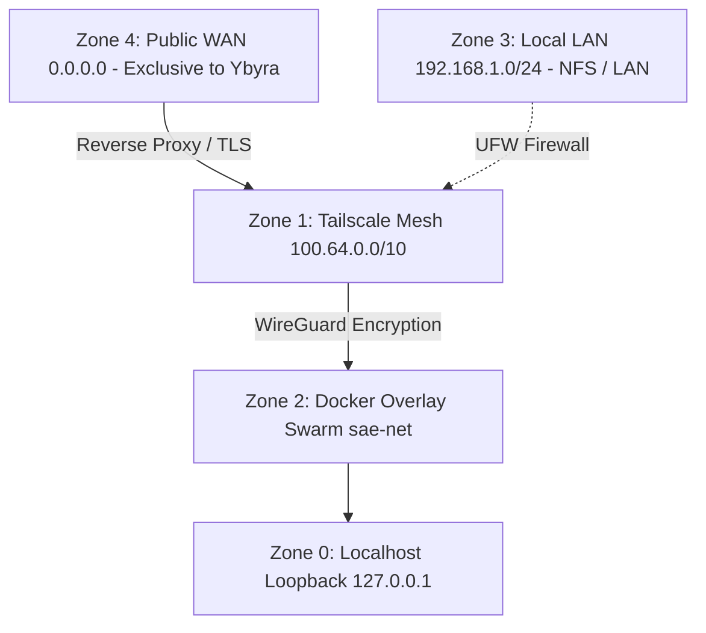

# Canonical Port Catalog & Attack Surface Matrix (Mnemocine Homelab)

> **Status:** Canonical reference audited by Stenio Sentinel (`stenio --ports`)  
> **Security Philosophy:** Zero Trust & Defense in Depth. Every open listening port MUST possess an explicit technical rationale, a restricted binding interface, and a direct link to documentation.

---

## 1. Trust Zones & Binding Policies

The homelab enforces strict network tier segregation. No service may listen outside its designated trust zone:

```mermaid
graph TD
    Z4[Zone 4: Public WAN 0.0.0.0 - Exclusive to Ybyra] -->|Reverse Proxy / TLS| Z1[Zone 1: Tailscale Mesh 100.64.0.0/10]
    Z3[Zone 3: Local LAN 192.168.1.0/24 - NFS / LAN] -.->|UFW Firewall| Z1
    Z1 -->|WireGuard Encryption| Z2[Zone 2: Docker Overlay Swarm sae-net]
    Z2 --> Z0[Zone 0: Localhost Loopback 127.0.0.1]
```

| Zone | Interface / Subnet | Permitted Exposure | Authorized Services |
|---|---|---|---|
| **Zone 0: Loopback** | `127.0.0.1`, `::1` | Isolated to local host | Docker Daemon (`2375`), IPC sockets, temporary development |
| **Zone 1: Tailnet** | `100.64.0.0/10` (`tailscale0`) | Private encrypted mesh (WireGuard) | **Mandatory default channel** for 95% of homelab services |
| **Zone 2: Swarm Overlay** | `sae-net` | Microservices and GPU worker nodes | Inter-container routing (API ↔ Valkey ↔ StênioREC) |
| **Zone 3: Local LAN** | `192.168.1.0/24` / `192.168.3.0/24` | Restricted to home physical Ethernet / Wi-Fi | NFSv4 (`2049`), Syncthing discovery (`22000`), KDE Connect (`1716`) |
| **Zone 4: Public WAN** | `0.0.0.0` (Open Internet) | **STRICTLY RESTRICTED** | Ports 80/443 on edge gateway node `ybyra` exclusively |

> [!CAUTION]
> **Prohibition of `0.0.0.0` on internal nodes:** Binding internal services (databases, inference APIs, or management dashboards) to `0.0.0.0` is strictly forbidden. If an internal service requires multi-node access, bind explicitly to its Tailscale IP (`100.x.y.z`) or the `tailscale0` interface.

---

## 2. Canonical Port Matrix by Node

### 2.1. Psicopompo (`100.82.51.112`) — Workstation, GPU Worker & Tailnet NAS

| Port / Proto | Bind Interface | Service | Technical Justification | Canonical Reference |
|---|---|---|---|---|
| `9090/tcp` | `127.0.0.1` + `100.82.51.112` | **`steniorec`** (Axum/Whisper) | GPU-accelerated audio transcription and streaming STT | [`../services/steniorec.md`](../services/steniorec.md) |
| `8384/tcp` | `127.0.0.1` + `100.82.51.112` | **Syncthing Web** | Web administration UI for vault synchronization | [`../backups/`](../backups/) |
| `22000/tcp,udp` | LAN + `tailscale0` | **Syncthing Protocol** | Mutual TLS encrypted synchronization transport | [`../backups/`](../backups/) |
| `2049/tcp` | `100.82.51.112` / `tailscale0` | **NFSv4 Server** | Encrypted shared NAS storage for `/mnt/BACKUP` (WireGuard) | [`nfs.md`](nfs.md) |
| `111/tcp,udp` | LAN | **rpcbind** | RPC port mapping daemon for legacy NFS operations | [`nfs.md`](nfs.md) |
| `20048/tcp,udp` | LAN | **rpc.mountd** | NFS mount request daemon | [`nfs.md`](nfs.md) |
| `61208/tcp` | `127.0.0.1` + `100.82.51.112` | **Glances** | System telemetry (CPU, RAM, GPU, thermal metrics) | [`service-topology.md`](service-topology.md) |
| `9100/tcp` | `100.82.51.112` / `tailscale0` | **Node Exporter** | Prometheus host performance exporter | [`../services/`](../services/) |
| `9080/tcp` | `127.0.0.1` (Localhost) | **Promtail** | Loki log shipping agent (HTTP health endpoint) | [`../services/`](../services/) |
| `9096/tcp` | `127.0.0.1` + `tailscale serve` | **wol-relay** | Wake-on-LAN daemon target to wake **kavure**; bound to loopback | [`../services/wol-relay.md`](../services/wol-relay.md) |
| `9092/tcp` | `0.0.0.0` (Swarm Ingress) | **Swarm Ingress Mesh** | Multi-host dynamic ingress load balancing | [`../services/`](../services/) |
| `7946/tcp,udp` | `tailscale0` (Filtered via UFW) | **Docker Swarm Gossip** | Distributed control plane clustering heartbeat | [`../services/`](../services/) |
| `4789/udp` | `100.82.51.112` / `tailscale0` | **Docker VXLAN Overlay** | Encapsulated overlay network packet routing | [`../services/`](../services/) |
| `2375/tcp` | `127.0.0.1` + `100.82.51.112` | **docker-socket-proxy** | Hardened read-only Docker socket proxy for Homepage | [`service-topology.md`](service-topology.md) |
| `5000/tcp` | `127.0.0.1` + `100.82.51.112` / `tailscale0` | **registry** | Homelab Docker image registry (TLS + htpasswd). Single source for Swarm images | [`../guides/docker-registry.md`](../guides/docker-registry.md) |
| `1716/tcp,udp` | LAN (Local Wi-Fi) | **KDE Connect** | Mobile device integration and clipboard syncing | Desktop use |

---

### 2.2. Kavure (`100.124.146.77`) — Swarm Manager & Core Services Node

| Port / Proto | Bind Interface | Service | Technical Justification | Canonical Reference |
|---|---|---|---|---|
| `9090/tcp` | `sae-net` (Overlay — unexposed on host) | **sae-core_api** | Sumænimá Hub Core REST & WebSocket API. Reached via edge reverse proxy (`/api/health` → 200). Note: `9090` on **psicopompo** hosts `steniorec` | [`../services/steniobot.md`](../services/steniobot.md) |
| `5432/tcp` | `sae-net` (Overlay — unexposed on host) | **PostgreSQL (sae-core_db)** | Relational database backend for Hub and core services | [`../services/`](../services/) |
| `6379/tcp` | `sae-net` (Overlay — unexposed on host) | **Valkey (sae-core_valkey)** | High-throughput in-memory cache and Pub/Sub message broker | [`../services/steniobot.md`](../services/steniobot.md) |
| `2377/tcp` | `100.124.146.77` / `tailscale0` | **Swarm Manager** | Docker Swarm cluster coordination and raft consensus | [`../services/`](../services/) |
| `7946/tcp,udp` | `100.124.146.77` / `tailscale0` | **Swarm Gossip** | Node discovery and health gossip across Swarm nodes | [`../services/`](../services/) |
| `4789/udp` | `100.124.146.77` / `tailscale0` | **Swarm VXLAN** | Inter-container overlay packet transport | [`../services/`](../services/) |
| `9092/tcp` | `100.124.146.77` / `tailscale0` | **backup-sentinel & Ingress** | Backup integrity healthcheck and cluster routing endpoint | [`../services/`](../services/) |
| `9100/tcp` | `100.124.146.77` / `tailscale0` | **Node Exporter** | Host OS performance metrics exporter | [`../services/`](../services/) |
| `61208/tcp` | `100.124.146.77` / `tailscale0` | **Glances** | Host hardware resource telemetry | [`service-topology.md`](service-topology.md) |
| `2375/tcp` | `100.124.146.77` / `tailscale0` | **docker-socket-proxy** | Restricted Docker API socket queried by Homepage | [`../services/homepage.md`](../services/homepage.md) |
| `3000/tcp` | `127.0.0.1` + `100.124.146.77` / `tailscale0` | **AioStreams** | Stream aggregation server (tailnet + public Funnel :10000) | [`../services/aiostreams.md`](../services/aiostreams.md) |
| `3001/tcp` | `100.124.146.77` / `tailscale0` | **Zomboid Control Panel** | Web administrative interface for Project Zomboid dedicated server | [`../servers/kavure.md`](../servers/kavure.md) |
| `3002/tcp` | `100.124.146.77` / `tailscale0` | **Grafana** | Central telemetry dashboard and metrics visualization | [`../services/`](../services/) |
| `3100/tcp` | `100.124.146.77` / `tailscale0` | **Loki** | Distributed log aggregation and storage daemon | [`../services/`](../services/) |
| `3003/tcp` | `100.124.146.77` / `tailscale0` | **Miracena Nuxt** | Miracena project Nuxt web frontend | [`../servers/kavure.md`](../servers/kavure.md) |
| `4533/tcp` | `100.124.146.77` / `tailscale0` | **Navidrome** | Subsonic-compatible personal music streaming service | [`../servers/kavure.md`](../servers/kavure.md) |
| `5678/tcp` | `100.94.209.99` / `tailscale0` | **n8n (Miracena)** | Workflow automation engine (Miracena stack; migrated to kuaray 2026-10-04) | [`../services/n8n.md`](../services/n8n.md) |
| `5678/tcp` | `100.124.146.77` / `tailscale0` | **n8n (Homelab)** | Standalone Homelab workflow engine (reactivated 2026-10-09; tailnet-only bind) | [`../services/n8n.md`](../services/n8n.md) |
| `8000/tcp` | `100.124.146.77` / `tailscale0` | **Comet** | Stremio torrent indexing and metadata addon | [`../services/comet.md`](../services/comet.md) |
| `8055/tcp` | `100.124.146.77` / `tailscale0` | **Directus** | Headless CMS and data layer | [`../servers/kavure.md`](../servers/kavure.md) |
| `8080/tcp` | `100.124.146.77` / `tailscale0` | **SearXNG Core** | Self-hosted privacy-preserving metasearch engine | [`../servers/kavure.md`](../servers/kavure.md) |
| `8083/tcp` | `100.124.146.77` / `tailscale0` | **Calibre Web** | eBook collection catalog and reader | [`../services/calibre-web.md`](../services/calibre-web.md) |
| `8085/tcp` | `100.124.146.77` / `tailscale0` | **Miracena WordPress** | Miracena legacy CMS environment | [`../servers/kavure.md`](../servers/kavure.md) |
| `8123/tcp` | `host` (Host networking — see §4) | **Home Assistant** | Home automation core and IoT sensor orchestration | [`../services/home-assistant.md`](../services/home-assistant.md) |
| `8444/tcp` | `100.124.146.77` / `tailscale0` | **Crafty Controller** | Web management panel for dedicated Minecraft server | [`../services/crafty.md`](../services/crafty.md) |
| `8766/tcp` | `100.124.146.77` / `tailscale0` | **sae-core_asciline** | Asciiline terminal streaming interface for Hub | [`../services/`](../services/) |
| `9091/tcp` | `100.124.146.77` / `tailscale0` | **Prometheus** | Time-series metrics storage and monitoring daemon | [`../services/`](../services/) |
| `9093/tcp` | `100.124.146.77` / `tailscale0` | **Alertmanager** | Alert routing and notification engine | [`../services/`](../services/) |
| `9096/tcp` | `127.0.0.1` + `tailscale serve` | **wol-relay** | Wake-on-LAN relay target to wake **psicopompo** | [`../services/wol-relay.md`](../services/wol-relay.md) |
| `25565/tcp` | LAN + `tailscale0` | **Minecraft Dominium** | Dedicated Minecraft server game port | [`../services/crafty.md`](../services/crafty.md) |
| `40000/udp` | `0.0.0.0`, `[::]` (`tailscaled`) | **Tailscale Peer Relay** | High-throughput direct peer-to-peer WireGuard relay | [`tailscale.md`](tailscale.md) |

---

### 2.3. Ybyra (`100.66.224.34`) — Cloud Primary Edge & DMZ Gateway

| Port / Proto | Bind Interface | Service | Technical Justification | Canonical Reference |
|---|---|---|---|---|
| `80/tcp` | `0.0.0.0` (Public WAN) | **Nginx Reverse Proxy** | Public HTTP listener (permanent redirect to HTTPS) | [`topology.md`](topology.md) |
| `443/tcp` | `0.0.0.0` (Public WAN) | **Nginx Reverse Proxy** | TLS termination (Certbot / Let's Encrypt) and reverse proxy routing | [`topology.md`](topology.md) |
| `2375/tcp` | `100.66.224.34` / `tailscale0` | **docker-socket-proxy** | Edge Docker metrics collector for Homepage over Tailnet | [`../services/homepage.md`](../services/homepage.md) |
| `9100/tcp` | `100.66.224.34` / `tailscale0` | **Node Exporter** | Edge host OS metrics scraped by Prometheus | [`../services/`](../services/) |
| `61208/tcp` | `100.66.224.34` / `tailscale0` | **Glances** | Edge node resource telemetry | [`service-topology.md`](service-topology.md) |
| `9092/tcp` | `tailscale0` (Swarm Ingress) | **Swarm Ingress Mesh** | Ingress mesh routing across cluster nodes | [`../services/`](../services/) |
| `7946/tcp,udp` | `tailscale0` | **Swarm Gossip** | Control plane cluster heartbeat | [`../services/`](../services/) |

---

### 2.4. Ybytu (`100.115.253.109`) — Cloud Exit Node & Auxiliary DNS

| Port / Proto | Bind Interface | Service | Technical Justification | Canonical Reference |
|---|---|---|---|---|
| `53/udp,tcp` | `tailscale0` | **AdGuard Home** | Network-wide filtering DNS — active peer in the parallel Tailscale race | [`dns.md`](dns.md) |
| `3000/tcp` | `tailscale0` | **AdGuard Web** | Web administration console and query audit log | [`dns.md`](dns.md) |
| `3001/tcp` | `tailscale0` | **Homepage** | Central homelab service navigation dashboard | [`../services/homepage.md`](../services/homepage.md) |
| `3002/tcp` | `tailscale0` | **Uptime Kuma** | Multi-node uptime monitor and incident alerting | [`service-topology.md`](service-topology.md) |
| `8082/tcp` | `tailscale0` | **ChangeDetection** | Web page update monitoring and alert engine | [`service-topology.md`](service-topology.md) |
| `8083/tcp` | `tailscale0` | **Ntfy** | Lightweight mobile push notification gateway | [`service-topology.md`](service-topology.md) |
| `9100/tcp` | `tailscale0` | **Node Exporter** | Host OS performance telemetry exporter | [`../services/`](../services/) |
| `61208/tcp` | `tailscale0` | **Glances** | Cloud host resource monitoring | [`service-topology.md`](service-topology.md) |
| `40000/udp` | `0.0.0.0`, `[::]` (`tailscaled`) | **Tailscale Peer Relay** | High-throughput direct peer-to-peer WireGuard relay | [`tailscale.md`](tailscale.md) |
| `9096/tcp` | `0.0.0.0` / `tailscale0` | **wol-dispatcher** | Smart WoL Dispatcher with automatic failover | [`../services/wol-relay.md`](../services/wol-relay.md) |

---

### 2.5. Kuaray (`100.94.209.99`) — Media Automation & Storage Mirror

| Port / Proto | Bind Interface | Service | Technical Justification | Canonical Reference |
|---|---|---|---|---|
| `2375/tcp` | `100.94.209.99` / `tailscale0` | **docker-socket-proxy** | Hardened Docker API proxy queried by Homepage | [`../services/homepage.md`](../services/homepage.md) |
| `8384/tcp` | `127.0.0.1` + `tailscale0` | **Syncthing Web** | Web admin interface for backup repository sync | [`../backups/`](../backups/) |
| `22000/tcp,udp` | LAN + `tailscale0` | **Syncthing Protocol** | Mutual TLS encrypted peer sync transport | [`../backups/`](../backups/) |
| `9100/tcp` | `tailscale0` | **Node Exporter** | Host performance metrics exporter | [`../services/`](../services/) |
| `61208/tcp` | `tailscale0` | **Glances** | Host hardware and disk storage telemetry | [`service-topology.md`](service-topology.md) |
| `9696/tcp` | `tailscale0` | **Prowlarr** | Centralized torrent indexer proxy manager | [`../servers/kuaray.md`](../servers/kuaray.md) |
| `8686/tcp` | `tailscale0` | **Lidarr** | Music collection management daemon | [`../services/lidarr.md`](../services/lidarr.md) |
| `8191/tcp` | `tailscale0` | **Flaresolverr** | Cloudflare verification bypass daemon | [`../services/flaresolverr.md`](../services/flaresolverr.md) |
| `9091/tcp` | `tailscale0` | **Transmission RPC** | Web management API for torrent client | [`../servers/kuaray.md`](../servers/kuaray.md) |
| `51413/tcp` | LAN + `tailscale0` | **Transmission Peer** | BitTorrent peer transfer port | [`../servers/kuaray.md`](../servers/kuaray.md) |
| `139,445/tcp` | LAN | **Samba (smbd)** | Local SMB file sharing for home clients | [`../servers/kuaray.md`](../servers/kuaray.md) |

---

## 3. Role of Stenio Sentinel as Port Gatekeeper

StenioSentinel enforces continuous automated compliance with this matrix:

1. **Active Local Host Scan (`stenio --ports`):**
   - Directly parses TCP/UDP sockets in `/proc/net/tcp` (<2ms execution).
   - Reconciles every listening port against this canonical matrix.
   - **Authorized Port:** Green confirmation with service name and documentation link.
   - **Orphan / Undocumented Port:** Yellow warning recommending immediate registration or process termination.
   - **Insecure Bind (`0.0.0.0`):** Fatal red security violation (`SEC-PORT-EXPOSURE`).

2. **Tailnet Mesh Probing (Multi-Node Verification):**
   - Asynchronous multi-socket TCP probes test whether remote nodes answer strictly on authorized ports.
   - Measures packet latency and validates UFW firewall isolation.

---

## 4. Legitimate `0.0.0.0` Exceptions

Not every `0.0.0.0` listening socket represents a vulnerability. The following entries are **explicitly audited, accepted exceptions**:

| Port | Service | Technical Justification |
|---|---|---|
| `8123/tcp` | **Home Assistant** | Operates with `network_mode: host` — **mandatory** for local LAN IoT discovery (mDNS, SSDP, Zeroconf). Restricting interfaces breaks home automation discovery protocols |
| `25565/tcp` | **Minecraft Dominium** | Game port authorized for `LAN + tailscale0` access to accommodate local household players |
| `8766/tcp` | **sae-core_asciline** | Published by Docker Swarm using `mode: host`: the Swarm API binds across all interfaces without per-interface bind support |

> **Golden Rule:** Any **new** listening socket on `0.0.0.0` not documented in this exception table constitutes an immediate security defect (`SEC-PORT-EXPOSURE`) and must be rebound to the host's private Tailscale IP (`100.x.y.z`).
