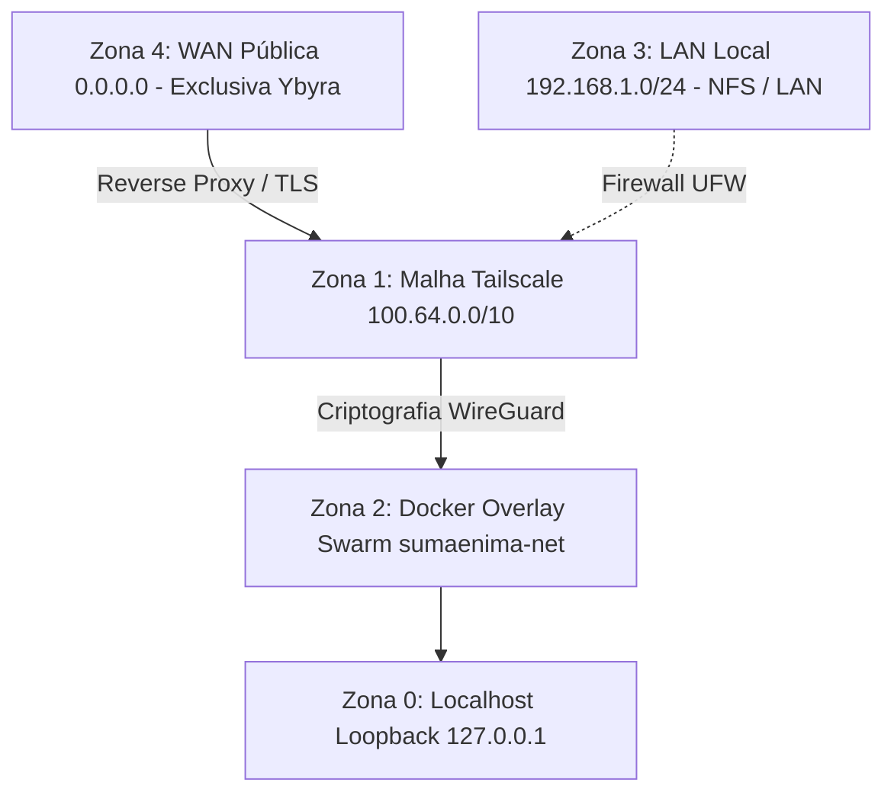

# Catálogo Canônico de Portas & Superfície de Ataque (Mnemocine Homelab)

> **Status:** Canônico e Auditável pelo Stênio Sentinel (`stenio --ports`)  
> **Filosofia de Segurança:** Zero Trust & Defense in Depth. Toda porta aberta DEVE ter justificativa explícita, interface restrita e vínculo direto com a documentação.

---

## 1. Zonas de Confiança & Diretrizes de Bind

O homelab adota a política de segregação estrita de rede. Nenhuma aplicação deve escutar fora da sua zona autorizada:

```mermaid
graph TD
    Z4[Zona 4: WAN Pública 0.0.0.0 - Exclusiva Ybyra] -->|Reverse Proxy / TLS| Z1[Zona 1: Malha Tailscale 100.64.0.0/10]
    Z3[Zona 3: LAN Local 192.168.1.0/24 - NFS / LAN] -.->|Firewall UFW| Z1
    Z1 -->|Criptografia WireGuard| Z2[Zona 2: Docker Overlay Swarm sumaenima-net]
    Z2 --> Z0[Zona 0: Localhost Loopback 127.0.0.1]
```

| Zona | Interface / Sub-rede | Exposição Permitida | Serviços Autorizados |
|---|---|---|---|
| **Zona 0: Loopback** | `127.0.0.1`, `::1` | Isolada no host local | Docker Daemon (`2375`), Sockets IPC, dev local temporário |
| **Zona 1: Tailnet** | `100.64.0.0/10` (`tailscale0`) | Privada e criptografada (WireGuard) | **Canal padrão obrigatório** para 95% dos serviços do homelab |
| **Zona 2: Swarm Overlay** | `sae-net` | Microsserviços e GPU workers | Comunicação inter-container (API ↔ Valkey ↔ StênioREC) |
| **Zona 3: LAN Local** | `192.168.1.0/24` (eth0/wlan0) | Restrita à rede cabeada/Wi-Fi da casa | NFSv4 (`2049`), Syncthing sync (`22000`), KDE Connect (`1716`) |
| **Zona 4: WAN Pública** | `0.0.0.0` (Internet aberta) | **ESTRITAMENTE RESTRITA** | Apenas portas 80/443 no nó de borda `ybyra` |

> [!CAUTION]
> **Proibição de `0.0.0.0` em nós internos:** É estritamente proibido bindar serviços internos (como bancos de dados, APIs de inferência ou painéis de controle) em `0.0.0.0`. Se o serviço precisa ser acessível por outro nó, use o IP Tailscale (`100.x.y.z`) ou a interface `tailscale0`.

---

## 2. Matriz Canônica de Portas por Nó

### 2.1. Psicopompo (`100.82.51.112`) — Dev, GPU Worker & NAS

| Porta / Proto | Bind / Interface | Serviço | Justificativa Técnica | Documentação Canônica |
|---|---|---|---|---|
| `9090/tcp` | `127.0.0.1` + `100.82.51.112` | **`steniorec`** (Axum/Whisper) | Inferência GPU de transcrição de áudio e streaming STT | [`../services/steniorec.md`](../services/steniorec.md) |
| `8384/tcp` | `127.0.0.1` + `100.82.51.112` | **Syncthing Web** | Interface administrativa de sincronização do Vault | [`../backups/`](../backups/) |
| `22000/tcp,udp` | LAN + `tailscale0` | **Syncthing Protocol** | Transferência criptografada mTLS de dados entre nós | [`../backups/`](../backups/) |
| `2049/tcp` | `100.82.51.112` / `tailscale0` | **NFSv4 Server** | Compartilhamento seguro do NAS `/mnt/BACKUP` (WireGuard) | [`nfs.md`](nfs.md) |
| `111/tcp,udp` | LAN | **rpcbind** | Mapeamento RPC para montagens NFS legadas/v3 | [`nfs.md`](nfs.md) |
| `20048/tcp,udp` | LAN | **rpc.mountd** | Daemon de montagem NFS | [`nfs.md`](nfs.md) |
| `61208/tcp` | `127.0.0.1` + `100.82.51.112` | **Glances** | Telemetria de CPU/RAM/GPU e métricas locais | [`service-topology.md`](service-topology.md) |
| `9100/tcp` | `100.82.51.112` / `tailscale0` | **Node Exporter** | Coleta Prometheus de métricas do sistema operacional | [`../services/`](../services/) |
| `9080/tcp` | `127.0.0.1` (Localhost) | **Promtail** | Agente de logs do Loki (endpoint HTTP/health) | [`../services/`](../services/) |
| `9096/tcp` | `127.0.0.1` (loopback) + `100.82.51.112` via `tailscale serve` | **wol-relay** | Daemon Wake-on-LAN — acorda o **kavure**; bind `127.0.0.1` (padrão canônico), exposto só na tailnet | [`../services/wol-relay.md`](../services/wol-relay.md) |
| `9092/tcp` | `0.0.0.0` (Swarm Ingress) | **Swarm Ingress Mesh** | Roteamento dinâmico multi-host de serviços do cluster | [`../services/`](../services/) |
| `7946/tcp,udp` | `tailscale0` (filtrado via UFW) | **Docker Swarm Gossip** | Plano de controle distribuído do cluster Swarm | [`../services/`](../services/) |
| `4789/udp` | `100.82.51.112` / `tailscale0` | **Docker VXLAN Overlay** | Encapsulamento de rede para containers do Swarm | [`../services/`](../services/) |
| `2375/tcp` | `127.0.0.1` + `100.82.51.112` | **docker-socket-proxy** | Proxy seguro com permissões restritas da API Docker (Homepage) | [`service-topology.md`](service-topology.md) |
| `5000/tcp` | `127.0.0.1` + `100.82.51.112` / `tailscale0` | **registry** | Registry de imagens Docker do ecossistema (TLS + htpasswd). Fonte única das imagens do Swarm | [`../guides/docker-registry.md`](../guides/docker-registry.md) |
| `1716/tcp,udp` | LAN (Wi-Fi local) | **KDE Connect** | Integração móvel com smartphone do operador | Uso desktop |

---

### 2.2. Kavure (`100.124.146.77`) — Swarm Manager & Serviços Core

> 📌 **Revisão de binds (02/10/2026):** comparado com o `provisioning/stacks/core.yml`
> (espelho no NAS, 29/09), **só `9092` (backup) e `8766` (asciline, `mode: host`) são
> publicados no host** — `api`, `valkey` e `db` vivem **apenas na overlay `sae-net`**
> (`Endpoint.Ports: null`, VIP `10.0.2.20`). As linhas corrigidas abaixo refletem isso;
> **pendência:** o monitor #50 do Uptime Kuma aponta para `:9090` (quebrado).

| Porta / Proto | Bind / Interface | Serviço | Justificativa Técnica | Documentação Canônica |
|---|---|---|---|---|
| `9090/tcp` | ~~`100.124.146.77` / `tailscale0`~~ → **`sae-net` (overlay — não publicado no host)** | **sae-core_api** | API Core REST & Websocket do Sumænimá Hub. **Corrigido 02/10/2026:** `Endpoint.Ports: null` — não há bind no host; alcance é pela borda do ybyra (`/api/health` → 200). O monitor #50 do Uptime Kuma (`100.124.146.77:9090`) está **quebrado** e precisa ser corrigido ou o port publicado (pendência). *Atenção:* o `9090` do **psicopompo** é outro serviço — `steniorec` (ver §2.1) | [`../services/steniobot.md`](../services/steniobot.md) |
| `5432/tcp` | `sae-net` (overlay — **não** publicado no host) | **PostgreSQL (sae-core_db)** | Banco relacional persistente SQLx. **Não** há bind na tailnet: o serviço é alcançado apenas de dentro da overlay (verificado 29/09/2026) | [`../services/`](../services/) |
| `6379/tcp` | ~~`100.124.146.77` / `tailscale0`~~ → **`sae-net` (overlay — não publicado no host)** | **Valkey (sae-core_valkey)** | Barramento Pub/Sub de eventos e cache em memória. **Corrigido 02/10/2026:** o `core.yml` não tem bloco `ports` para o valkey — acessível só de dentro da overlay | [`../services/steniobot.md`](../services/steniobot.md) |
| `2377/tcp` | `100.124.146.77` / `tailscale0` | **Swarm Manager** | Gerenciamento e orquestração do cluster Docker Swarm | [`../services/`](../services/) |
| `7946/tcp,udp` | `100.124.146.77` / `tailscale0` | **Swarm Gossip** | Descoberta e heartbeat entre nós do cluster | [`../services/`](../services/) |
| `4789/udp` | `100.124.146.77` / `tailscale0` | **Swarm VXLAN** | Rede overlay para comunicação direta entre containers | [`../services/`](../services/) |
| `9092/tcp` | `100.124.146.77` / `tailscale0` | **backup-sentinel & Swarm Ingress** | Health check de backup e roteamento Swarm | [`../services/`](../services/) |
| `9100/tcp` | `100.124.146.77` / `tailscale0` | **Node Exporter** | Exportador de métricas do host Kavure | [`../services/`](../services/) |
| `61208/tcp` | `100.124.146.77` / `tailscale0` | **Glances** | Telemetria do host (CPU/RAM/disco) | [`service-topology.md`](service-topology.md) |
| `2375/tcp` | `100.124.146.77` / `tailscale0` | **docker-socket-proxy** | Proxy Docker monitorado pelo Homepage | [`../services/homepage.md`](../services/homepage.md) |
| `3000/tcp` | `127.0.0.1` (loopback) + `100.124.146.77` / `tailscale0` | **AioStreams** | Servidor de agregação de streams (Tailnet + Funnel público :10000) | [`../services/aiostreams.md`](../services/aiostreams.md) |
| `3001/tcp` | `100.124.146.77` / `tailscale0` | **Zomboid Control Panel** | Painel web de gestão do servidor Project Zomboid | [`../servers/kavure.md`](../servers/kavure.md) |
| `3002/tcp` | `100.124.146.77` / `tailscale0` | **Grafana** | Dashboards de observabilidade e métricas | [`../services/`](../services/) |
| `3100/tcp` | `100.124.146.77` / `tailscale0` | **Loki** | Coletor e indexador central de logs do homelab | [`../services/`](../services/) |
| `3003/tcp` | `100.124.146.77` / `tailscale0` | **Miracena Nuxt** | Frontend web do projeto Miracena | [`../servers/kavure.md`](../servers/kavure.md) |
| `4533/tcp` | `100.124.146.77` / `tailscale0` | **Navidrome** | Servidor de streaming de áudio pessoal | [`../servers/kavure.md`](../servers/kavure.md) |
| `5678/tcp` | `100.124.146.77` / `tailscale0` | **n8n** | Plataforma de automação de workflows | [`../servers/kavure.md`](../servers/kavure.md) |
| `8000/tcp` | `100.124.146.77` / `tailscale0` | **Comet** | Addon Stremio e indexador | [`../services/comet.md`](../services/comet.md) |
| `8055/tcp` | `100.124.146.77` / `tailscale0` | **Directus** | Headless CMS e API do ecossistema | [`../servers/kavure.md`](../servers/kavure.md) |
| `8080/tcp` | `100.124.146.77` / `tailscale0` | **SearXNG Core** | Metabusca privada e livre de rastreamento | [`../servers/kavure.md`](../servers/kavure.md) |
| `8083/tcp` | `100.124.146.77` / `tailscale0` | **Calibre Web** | Biblioteca digital e leitor de e-books | [`../services/calibre-web.md`](../services/calibre-web.md) |
| `8085/tcp` | `100.124.146.77` / `tailscale0` | **Miracena WordPress** | CMS web Miracena | [`../servers/kavure.md`](../servers/kavure.md) |
| `8123/tcp` | `host` (rede do host — exceção em §4) | **Home Assistant** | Automação residencial e dashboards IoT | [`../services/home-assistant.md`](../services/home-assistant.md) |
| `8444/tcp` | `100.124.146.77` / `tailscale0` | **Crafty Controller** | Painel de gestão do servidor Minecraft | [`../services/crafty.md`](../services/crafty.md) |
| `8766/tcp` | `100.124.146.77` / `tailscale0` | **sae-core_asciline** | Interface terminal Asciiline do Hub | [`../services/`](../services/) |
| `9091/tcp` | `100.124.146.77` / `tailscale0` | **Prometheus** | Banco de séries temporais de monitoramento | [`../services/`](../services/) |
| `9093/tcp` | `100.124.146.77` / `tailscale0` | **Alertmanager** | Roteador de alertas e notificações | [`../services/`](../services/) |
| `9096/tcp` | `127.0.0.1` (loopback) + `100.124.146.77` via `tailscale serve` | **wol-relay** | Daemon Wake-on-LAN — acorda o **psicopompo**; era `0.0.0.0` e foi fechado para a LAN em 02/10/2026 (endpoint sem auth) | [`../services/wol-relay.md`](../services/wol-relay.md) |
| `25565/tcp` | LAN + `tailscale0` | **Minecraft Dominium** | Servidor de jogo Minecraft Dominium | [`../services/crafty.md`](../services/crafty.md) |
| `40000/udp` | `0.0.0.0`, `[::]` (`tailscaled`) | **Tailscale Peer Relay** | Relay ponto a ponto de alta vazão para conexões cliente-a-cliente | [`tailscale.md`](tailscale.md) |

---

### 2.3. Ybyra (`100.66.224.34`) — Cloud Borda Primária (DMZ / Edge)

| Porta / Proto | Bind / Interface | Serviço | Justificativa Técnica | Documentação Canônica |
|---|---|---|---|---|
| `80/tcp` | `0.0.0.0` (WAN Pública) | **Nginx Reverse Proxy** | HTTP público (redirecionamento permanente para HTTPS) | [`topology.md`](topology.md) |
| `443/tcp` | `0.0.0.0` (WAN Pública) | **Nginx Reverse Proxy** | Terminação TLS (Certbot / Let's Encrypt) e proxy reverso | [`topology.md`](topology.md) |
| `2375/tcp` | `100.66.224.34` / `tailscale0` | **docker-socket-proxy** | Telemetria Docker para Homepage via Tailnet | [`../services/homepage.md`](../services/homepage.md) |
| `9100/tcp` | `100.66.224.34` / `tailscale0` | **Node Exporter** | Métricas de borda consumidas pelo Prometheus via Tailnet | [`../services/`](../services/) |
| `61208/tcp` | `100.66.224.34` / `tailscale0` | **Glances** | Telemetria do servidor de borda | [`service-topology.md`](service-topology.md) |
| `9092/tcp` | `tailscale0` (Swarm Ingress) | **Swarm Ingress Mesh** | Roteamento dinâmico de borda do cluster | [`../services/`](../services/) |
| `7946/tcp,udp` | `tailscale0` | **Swarm Gossip** | Heartbeat e comunicação de cluster | [`../services/`](../services/) |

---

### 2.4. Ybytu (`100.115.253.109`) — Cloud Exit Node & Infra DNS

| Porta / Proto | Bind / Interface | Serviço | Justificativa Técnica | Documentação Canônica |
|---|---|---|---|---|
| `53/udp,tcp` | `tailscale0` | **AdGuard Home** | DNS com filtro — **failover do Pi-hole** (corrida Tailscale; vence quando o kavure está lento/caído) + clientes diretos | [`dns.md`](dns.md) |
| `3000/tcp` | `tailscale0` | **AdGuard Web** | Painel de controle e auditoria de consultas DNS | [`dns.md`](dns.md) |
| `3001/tcp` | `tailscale0` | **Homepage** | Dashboard central de serviços e status | [`../services/homepage.md`](../services/homepage.md) |
| `3002/tcp` | `tailscale0` | **Uptime Kuma** | Monitor de disponibilidade de todos os serviços e nós | [`service-topology.md`](service-topology.md) |
| `8082/tcp` | `tailscale0` | **ChangeDetection** | Monitoramento de alterações em páginas web | [`service-topology.md`](service-topology.md) |
| `8083/tcp` | `tailscale0` | **Ntfy** | Servidor de notificações push para incidentes e alertas | [`service-topology.md`](service-topology.md) |
| `9100/tcp` | `tailscale0` | **Node Exporter** | Exportador de métricas do host Ybytu | [`../services/`](../services/) |
| `61208/tcp` | `tailscale0` | **Glances** | Telemetria do host Ybytu | [`service-topology.md`](service-topology.md) |
| `40000/udp` | `0.0.0.0`, `[::]` (`tailscaled`) | **Tailscale Peer Relay** | Relay ponto a ponto de alta vazão para conexões cliente-a-cliente | [`tailscale.md`](tailscale.md) |
| `9096/tcp` | `0.0.0.0` / `tailscale0` | **wol-dispatcher** | Smart WoL Dispatcher com auto-failover (Kururu ➔ par x86) | [`../services/wol-relay.md`](../services/wol-relay.md) |

---

### 2.5. Kuaray (`100.94.209.99`) — Servidor Multimídia & Automação

| Porta / Proto | Bind / Interface | Serviço | Justificativa Técnica | Documentação Canônica |
|---|---|---|---|---|
| `2375/tcp` | `100.94.209.99` / `tailscale0` | **docker-socket-proxy** | Proxy Docker consultado pelo Homepage | [`../services/homepage.md`](../services/homepage.md) |
| `8384/tcp` | `127.0.0.1` + `tailscale0` | **Syncthing Web** | Interface administrativa de sincronização | [`../backups/`](../backups/) |
| `22000/tcp,udp` | LAN + `tailscale0` | **Syncthing Protocol** | Tráfego de sincronização do Vault no Kuaray | [`../backups/`](../backups/) |
| `9100/tcp` | `tailscale0` | **Node Exporter** | Exportador de métricas do host Kuaray | [`../services/`](../services/) |
| `61208/tcp` | `tailscale0` | **Glances** | Telemetria de CPU/RAM e discos do Kuaray | [`service-topology.md`](service-topology.md) |
| `9696/tcp` | `tailscale0` | **Prowlarr** | Gerenciador e integrador de indexadores torrent | [`../servers/kuaray.md`](../servers/kuaray.md) |
| `8686/tcp` | `tailscale0` | **Lidarr** | Gerenciador de biblioteca de música | [`../services/lidarr.md`](../services/lidarr.md) |
| `8191/tcp` | `tailscale0` | **Flaresolverr** | Bypass de proteção Cloudflare para automações | [`../services/flaresolverr.md`](../services/flaresolverr.md) |
| `9091/tcp` | `tailscale0` | **Transmission RPC** | Interface de controle de downloads torrent | [`../servers/kuaray.md`](../servers/kuaray.md) |
| `51413/tcp` | LAN + `tailscale0` | **Transmission Peer** | Porta de transferência P2P de torrents | [`../servers/kuaray.md`](../servers/kuaray.md) |
| `139,445/tcp` | LAN | **Samba (smbd)** | Compartilhamento de arquivos na rede local | [`../servers/kuaray.md`](../servers/kuaray.md) |

---

## 3. Papel do Stênio Sentinel como Guardião das Portas

O Stênio executa auditorias de conformidade com este catálogo:

1. **Varredura Ativa Local (`stenio --ports`):**
   - Inspeciona os sockets TCP/UDP ouvindo no host local em tempo de execução via `/proc/net/tcp` (<2ms).
   - Compara cada porta com este catálogo.
   - **Porta Autorizada:** Identificada com serviço e link canônico.
   - **Porta Órfã / Não Documentada:** Alerta em amarelo com recomendação de cadastro ou encerramento do processo.
   - **Bind Inseguro (`0.0.0.0`):** Alerta em vermelho com violação de segurança (`SEC-PORT-EXPOSURE`).

2. **Auditoria da Malha Tailscale (Multi-Node Probing):**
   - Através de conexões TCP assíncronas via `tokio::net::TcpStream`, o Stênio testa se nós remotos respondem apenas nas portas autorizadas.
   - Mede latência e valida o isolamento de firewalls (UFW).

---

## 4. Exceções Legitimadas de `0.0.0.0`

Nem todo `0.0.0.0` no Kavure é violação. Estas são **exceções auditadas e aceitas** (não
corrigir; o alerta vermelho é esperado aqui):

| Porta | Serviço | Por que é exceção |
|---|---|---|
| `8123/tcp` | **Home Assistant** | Roda com `network_mode: host` — **obrigatório** para descoberta de dispositivos IoT na LAN (mDNS/SSDP/Zeroconf). A doc oficial do HA exige host networking para auto-descoberta. Restringir a interface quebraria a integração com os dispositivos da casa |
| `25565/tcp` | **Minecraft Dominium** | Acesso de jogo — a própria matriz autoriza `LAN + tailscale0` para este serviço (jogadores locais) |
| `8766/tcp` | **sae-core_asciline** | Publicado pelo **Swarm** com `mode: host`: o `ports[].mode=host` do `stack deploy` publica em todas as interfaces e **não expõe opção de bind por interface** — limitação da API do Swarm, não escolha do operador |

> **Regra de ouro:** qualquer **novo** `0.0.0.0` que não esteja nesta tabela é violação
> (`SEC-PORT-EXPOSURE`) e deve ser corrigido para o IP da tailnet (`100.x.y.z`).

### Correção em massa de 29/09/2026

Uma auditoria cruzada (`stenio --ports` vs. esta matriz) encontrou **14 bindings em
`0.0.0.0`** que divergiam do catálogo — todos migrados para `100.124.146.77` via
`sed` no compose + `docker compose up -d`, com backup `.bak-bind-20260929` de cada
arquivo:

| Serviço | Antes | Depois |
|---|---|---|
| SearXNG (`8080`) | `SEARXNG_HOST=0.0.0.0` no `.env` | `SEARXNG_HOST=100.124.146.77` |
| Navidrome (`4533`), Zomboid Panel (`3001`), Comet (`8000`) | `0.0.0.0` | tailnet |
| Directus (`8055`), NPM (`81`/`8180`/`8445`), WordPress (`8085`) | `0.0.0.0` | tailnet |
| Miracena Nuxt (`3003`), n8n (`5678`) | `0.0.0.0` | tailnet |
| Home Assistant (`8123`) | `0.0.0.0` | **exceção** (host networking — ver §4) |
| Prometheus (`9091`), Alertmanager (`9093`), Loki (`3100`), Calibre (`8083`) | `0.0.0.0` | tailnet |
| Crafty (`8444`) | `0.0.0.0` | tailnet |

**Validado:** todas as portas respondem na tailnet (`100.124.146.77`) e **recusam
conexão pela LAN** (`192.168.3.41`). O **Funnel público do Miracena
(`miracena.chimaera-heptatonic.ts.net`) seguiu respondendo 200** — a exposição
legítima à internet não foi afetada.

**Além disso, 2 containers órfãos foram eliminados** (rodavam via `docker run`, violando
a regra de config-as-code do `AGENTS.md` #3):
- **`comet`** → compose criado em `/home/kavure/homelab/comet/`
- **`aiostreams`** → compose criado em `/home/kavure/homelab/aiostreams/` (o `SECRET_KEY`
  foi extraído para `.env` `600`)
