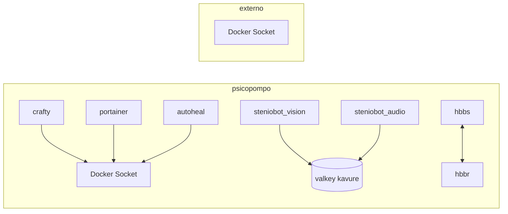
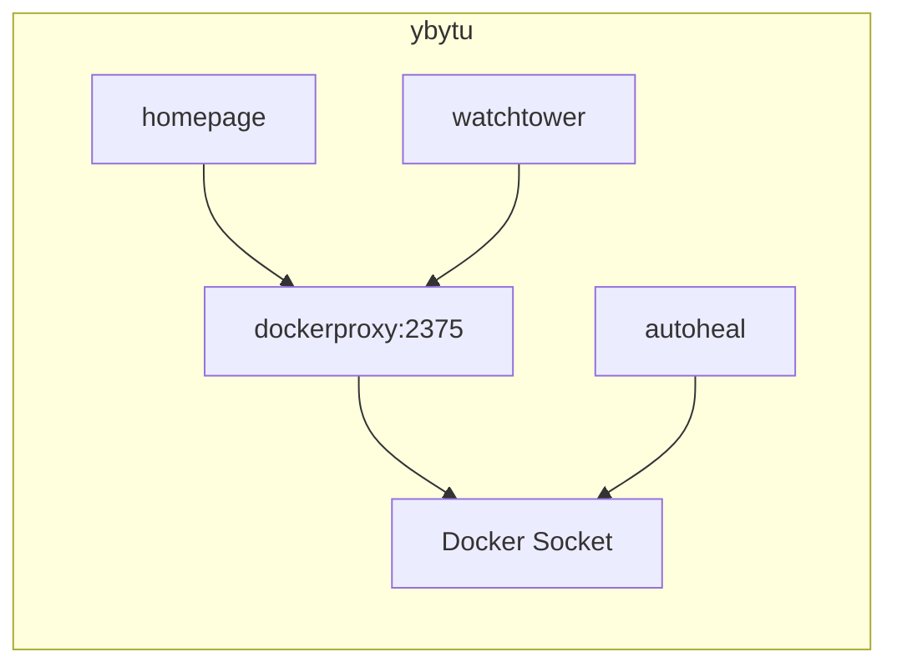
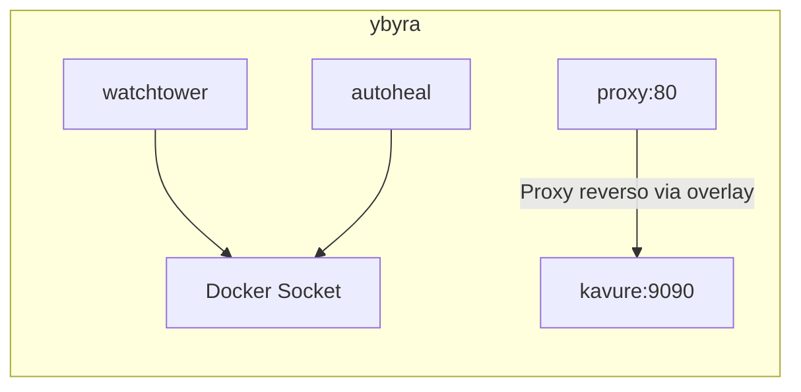
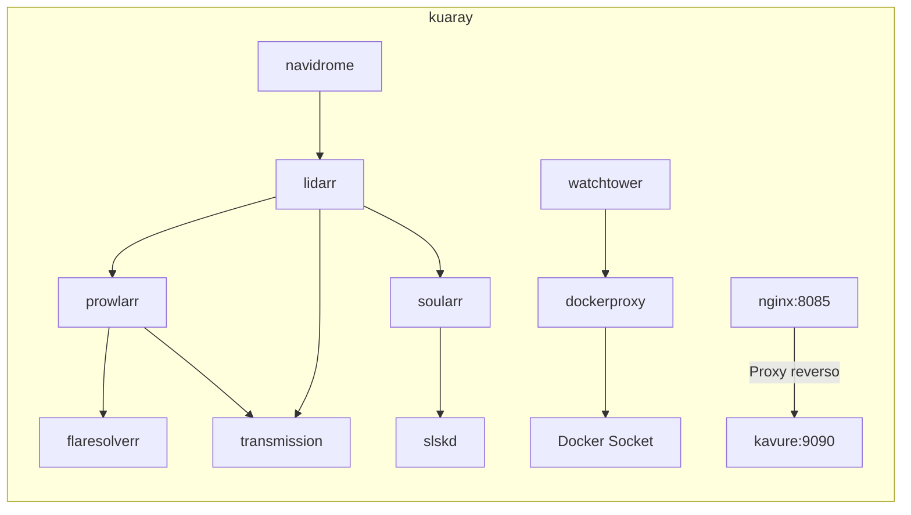
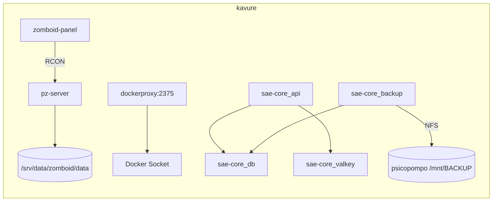

# Topologia de Serviços

Mapeamento de dependências entre os serviços do homelab.

## Psicopompo

> **Estado (07/08/2026):** stack `sumaenimahub` (StênioBOT, Umami) **migrada para o kavure** — o psicopompo agora é **role=gpu** (GPU workers vision/audio/ollama via `gpu.yml` standalone, conectados à overlay do Swarm do kavure) + build-node. Portainer, Crafty, Glances, dockerproxy, watchtower, autoheal **ativos**.

### Redes Docker

```
sumaenima_sumaenima-net (overlay do Swarm do kavure)  — GPU workers
├── steniobot_vision ────→ valkey (kavure), api (kavure) via overlay
├── steniobot_audio ─────→ valkey (kavure), api (kavure) via overlay
└── steniobot_ollama ────→ porta 11434 (API no kavure alcança via overlay)

minecraftserver_default (172.19.0.0/16)
└── crafty-controller ───→ portas: 8443, 25565, 8123, 25575 (bind host)

rustdesk-server_default (172.20.0.0/16)  — PARADO
├── hbbs (signal server) ──→ porta 21115-21116
└── hbbr (relay server) ───→ porta 21117

glances_default (172.21.0.0/16)
└── glances ────────────→ porta 61208

bridge (172.17.0.0/16)
├── portainer ───────────→ porta 9000
└── autoheal
```

### Dependências



### Volumes Compartilhados

| Volume | Montagem | Serviço |
|---|---|---|
| `steniobot_valkey` | `/data` | steniobot_valkey |
| `umami_db` | `/var/lib/postgresql/data` | umami_db |
| `steniobot_db` | `/var/lib/postgresql/data` | steniobot_db |
| `crafty` | `/crafty/` | crafty-controller |

---

## Ybytu

### Redes Docker

```
bridge (172.17.0.0/16)
├── adguardhome ─────────→ portas: 53, 3000
├── glances ────────────→ porta 61208
├── watchtower ──────────→ dockerproxy (Docker API)
├── dockerproxy ─────────→ Docker Socket (protegido)
├── autoheal ───────────→ Docker Socket
├── uptime-kuma ────────→ porta 3002
├── changedetection ────→ porta 8082
└── ntfy ────────────────→ porta 8083

homepage_default (172.18.0.0/16)
└── homepage ───────────→ dockerproxy:DOCKER_HOST → porta 3001
```

### Dependências



---

## Ybyra

### Redes Docker

```
bridge (172.17.0.0/16)
├── watchtower ──────────→ Docker API
├── autoheal ───────────→ Docker Socket
├── glances ────────────→ porta 61208
├── filebrowser ────────→ porta 8334
└── syncthing ──────────→ porta 8384, 22000
```

### Serviços Nativos
- **nginx**: Porta 80. Hospeda o SPA frontend (Borda Primária) e atua como proxy reverso para a API.

### Dependências



---

## Kuaray

> **⚠️ DEPRECIADO (28/08/2026):** nó retirado da topologia ativa. Serviços em kuaray não fazem mais parte de nenhum papel operacional; referência abaixo é histórica.

> **Estado (10/08/2026):** arr-stack + infra rodam via **docker-compose** (`/home/kuaray/homelab/{serviço}/`, config-as-code). **HA, Pi-hole, Navidrome, Calibre migrados para o kavure** (09/08). Watchtower reativado (09/08). `calibre-web` removido (biblioteca perdida 08/08); **Kavita removido 10/08** (não era mais usado).

### Redes Docker

```
bridge (172.17.0.0/16)
├── prowlarr ───────────→ porta 9696
├── flaresolverr ───────→ porta 8191
├── lidarr ─────────────→ porta 8686 ✅ reativado 06/08
├── transmission ───────→ portas: 9091, 51413 ✅ reativado 06/08
├── soularr ────────────→ porta 8265 ✅ reativado 06/08
├── slskd ──────────────→ porta 5030 ✅ reativado 06/08
├── navidrome ──────────→ porta 4533 ✅ reativado 06/08
├── calibre-web ────────→ porta 8083 ⚠️ EXITED
├── vert ───────────────→ porta 3030
├── dockerproxy ────────→ porta 2375
├── watchtower ─────────→ dockerproxy
└── autoheal ───────────→ Docker Socket

host (rede do host)
├── pihole ─────────────→ porta 53 (migrado p/ kavure 09/08)
├── syncthing ──────────→ porta 22000

Serviços Nativos
└── nginx ──────────────→ porta 8085 (Borda Secundária SPA + proxy reverso)

big-bear-vert_default
└── vert (também na bridge)
```

### Dependências do *arr Stack



### Dependências Detalhadas

| Serviço | Depende de | Serviço / Recurso |
|---|---|---|
| **lidarr** | → prowlarr | Indexers de torrent |
| | → transmission | Downloader |
| | → soularr | Download alternativo (Soulseek) |
| **prowlarr** | → flaresolverr | Resolver Cloudflare |
| **soularr** | → slskd | Cliente Soulseek |
| **navidrome** | → lidarr | Organização da biblioteca |
| **watchtower** | → dockerproxy | API Docker |
| **homepage (ybytu)** | → dockerproxy (kuaray?) | Status dos containers | |

## Kavure

> **Estado (16/08/2026):** **Project Zomboid ativo** + **Zomboid Control Panel** + **dockerproxy** + **infra `ops`** + **Sumænimá sae-core (Swarm manager)**. **Recebidos do kuaray (09/08):** **Home Assistant** (`:10000` funnel), **Pi-hole** (`:53` tailscale, host network), **Navidrome** (`:4533`, música via NFS), **Calibre Web** (`:8083`, livros via NFS). **AioStreams** (`:3000`) + **Comet** (`:8000`) migrados 09/08. **HA reconfigurado 16/08** (caps Bluetooth + HACS). **Mosquitto removido do kuaray 16/08** (sem uso). Host em **America/Sao_Paulo**.

### Redes Docker

```
sumaenima_sumaenima-net (overlay — Swarm, manager = kavure)
├── sae-core_db ──────────→ PostgreSQL 16 (pgvector), /srv/data/sumaenimahub/volumes/
├── sae-core_valkey ──────→ cache/broker
├── sae-core_api ─────────→ FastAPI :9090 (publicada no host)
├── sae-core_umami-db ────→ PostgreSQL 15 (umami)
├── sae-core_backup ──────→ sentinel Borg (NFS → psicopompo /mnt/BACKUP/sumaenima-server-kavure/)
├── sae-core_asciline ────→ streaming ASCII :8766
└── sae-edge_* ───────────→ proxy/tunnel/umami (ybyra primary; kavure standby — label `edge_backup=true`; ~~datavis~~ removido 22/09/2026 — legado)

zomboid_default (172.18.0.0/16)
├── pz-server ───────────→ portas: 16261-16262/udp (game), 27015/tcp (RCON)
└── zomboid-panel ───────→ porta 3001 (painel; conecta RCON em `pz-server`)

dockerproxy_default (172.19.0.0/16)
└── dockerproxy ─────────→ porta 2375 (Docker Socket protegido; usado pelo homepage)

ops_default
├── autoheal ────────────→ (monitora containers unhealthy via Docker API)
├── watchtower ──────────→ (auto-update de imagens, schedule 03:00 BRT, cleanup)
└── glances ─────────────→ porta 61208
```

### Dependências



## Dependências Cross-Server

| Serviço | Servidor | Depende de | Servidor |
|---|---|---|---|
| Syncthing | psicopompo | ↔ Syncthing | kuaray |
| Syncthing | ybyra | ↔ Syncthing | psicopompo |
| Homepage (dashboard) | ybytu | → dockerproxy | psicopompo (via Tailnet) |
| Homepage (dashboard) | ybytu | → dockerproxy | kuaray (via Tailnet) |
| Homepage (dashboard) | ybytu | → dockerproxy | kavure (via Tailnet) |
| Sumænimá (SPA Frontend) | ybyra (primary) / kavure (standby) | → Sumænimá Backend API | **kavure** (porta 9090, via overlay Swarm) |
| Sumænimá GPU workers | psicopompo | → valkey/api/ollama | kavure (via overlay `sumaenima_sumaenima-net`) |

## Auto-Start & Health

### Autoheal (4 servidores)
| Servidor | Container | Config | Status |
|---|---|---|---|
| psicopompo | autoheal | Monitora todos, intervalo 5s | ✅ healthy |
| ybytu | autoheal | Monitora todos, intervalo 5s | ✅ healthy |
| ybyra | autoheal | Monitora todos, intervalo 5s | ✅ healthy |
| kuaray | autoheal-autoheal-1 | Monitora todos, intervalo 5s | ✅ healthy |
| kavure | autoheal | Monitora todos (`AUTOHEAL_CONTAINER_LABEL=all`), intervalo 5s | ✅ healthy |

### Watchtower
| Servidor | Container | Config | Status |
|---|---|---|---|
| psicopompo | watchtower | ✅ Ativo, cleanup=true, API 1.40, polling 24h | ✅ healthy |
| ybytu | watchtower | ✅ Ativo, sem auto-cleanup | ✅ healthy |
| ybyra | watchtower | ✅ Ativo | ✅ healthy |
| kuaray | watchtower | ✅ Ativo, cleanup=true, polling 24h | ✅ healthy |
| kavure | watchtower | ✅ Ativo, cleanup=true, **schedule 03:00 (BRT)**, stop-timeout 30s | ✅ healthy |

### Restart Policies
| Servidor | Políticas |
|---|---|
| psicopompo | Todos `unless-stopped` ou `always` |
| ybytu | Todos `unless-stopped` ou `always` |
| ybyra | Todos `unless-stopped` |
| kuaray | Todos `unless-stopped` ou `always` |
| kavure | Todos `unless-stopped` (pz-server, panel, dockerproxy, ops) |

### Systemd (auto-start no boot)
| Serviço | psicopompo | ybytu | ybyra | kuaray | kavure |
|---|---|---|---|---|---|
| docker | ✅ enabled | ✅ enabled | ✅ enabled | ✅ enabled | ✅ enabled |
| tailscaled | ✅ enabled | ✅ enabled | ✅ enabled | ✅ enabled | ✅ enabled |
| filebrowser | — | ✅ enabled | — | — | — |
