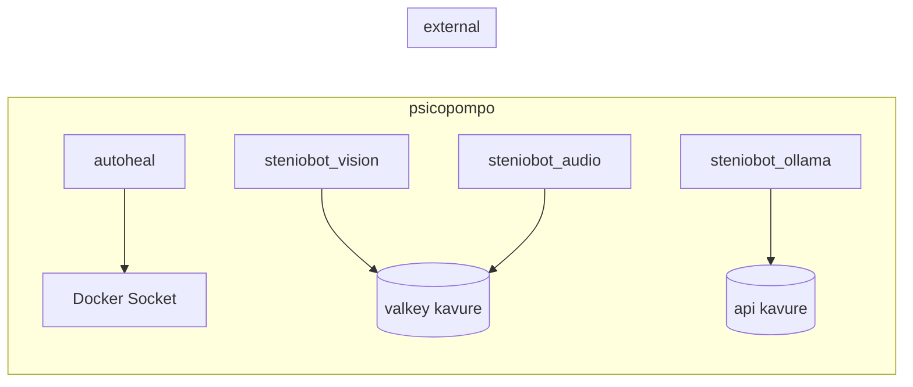
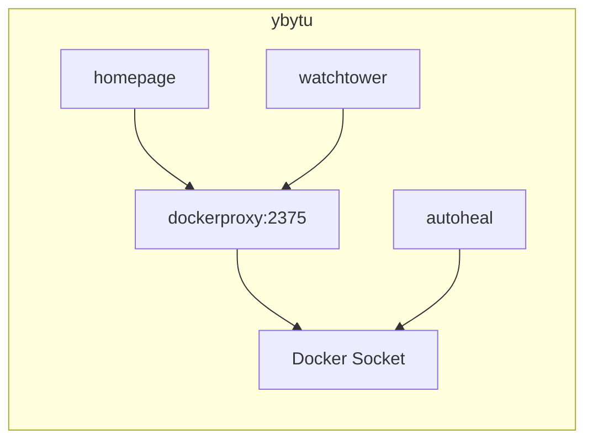
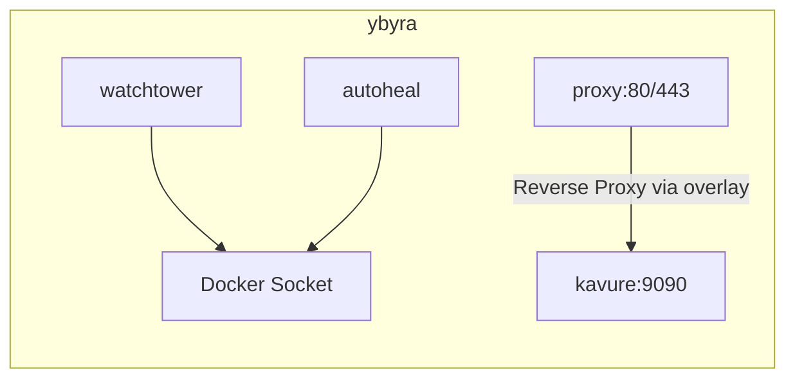
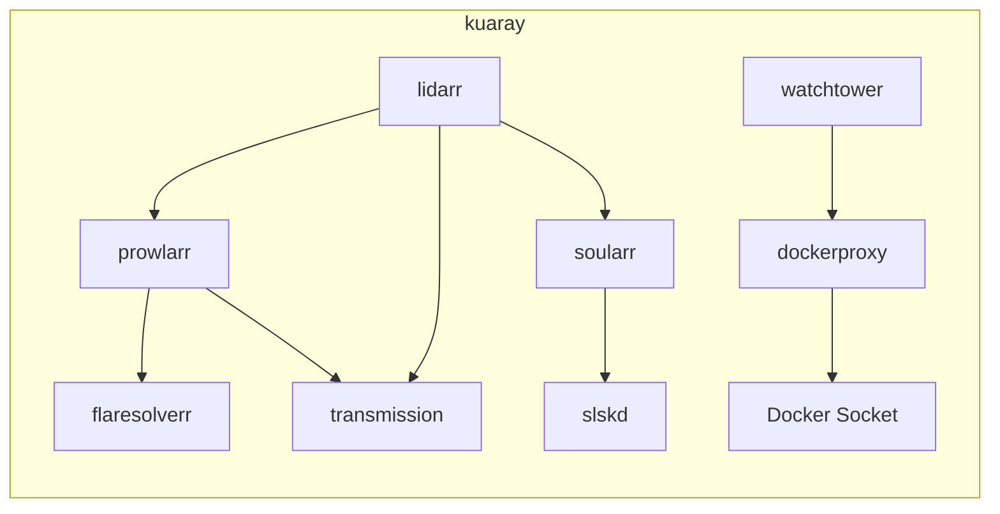
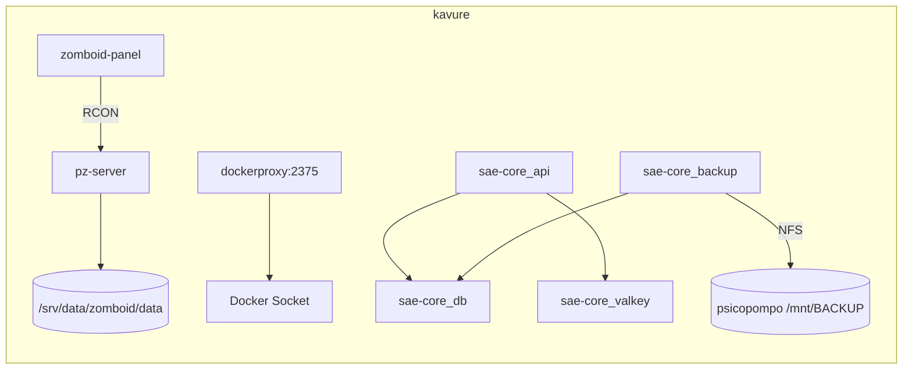

# Service Topology

Service dependency and interconnect topology across the homelab infrastructure.

## Psicopompo

> **Operational State (2026-08-07):** The core `sumaenimahub` stack (StênioBOT, Umami) was **migrated to kavure** — psicopompo now operates primarily with **`role=gpu`** (GPU workers vision/audio/ollama via standalone `gpu.yml`, connected to the kavure Swarm overlay) alongside serving as local build node and storage NAS.
> **Correction (2026-10-02):** **Portainer and Crafty no longer run on psicopompo** (8 active system containers: autoheal, dockerproxy, glances, node-exporter, promtail, registry, steniorec, watchtower). See [`network/topology.md`](../network/topology.md) §Docker Subnets.

### Docker Networks

```text
sae-net (Swarm overlay managed by kavure) — GPU Workers
├── steniobot_vision ────→ valkey (kavure), api (kavure) via overlay
├── steniobot_audio ─────→ valkey (kavure), api (kavure) via overlay
└── steniobot_ollama ────→ port 11434 (kavure API reaches via overlay)

minecraftserver_default (172.19.0.0/16) — (Historical / Decommissioned)
└── crafty-controller ───→ (Migrated to kavure)

rustdesk-server_default (172.20.0.0/16) — DECOMMISSIONED
├── hbbs (signal server) ──→ ports 21115-21116
└── hbbr (relay server) ───→ port 21117

glances_default (172.21.0.0/16)
└── glances ────────────→ port 61208

bridge (172.17.0.0/16)
└── autoheal
```

### Dependencies


```mermaid
graph LR
    subgraph psicopompo
        I[autoheal] --> G[Docker Socket]
        V[steniobot_vision] --> K[(valkey kavure)]
        A[steniobot_audio] --> K
        O[steniobot_ollama] --> API[(api kavure)]
    end

    subgraph external
        G[Docker Socket]
    end
```

### Shared Volumes

| Volume | Mount Path | Target Service |
|---|---|---|
| `steniobot_valkey` | `/data` | (Historical — migrated to kavure) |
| `umami_db` | `/var/lib/postgresql/data` | (Historical — migrated to kavure) |
| `steniobot_db` | `/var/lib/postgresql/data` | (Historical — migrated to kavure) |

---

## Ybytu

### Docker Networks

```text
bridge (172.17.0.0/16)
├── adguardhome ─────────→ ports: 53, 3000
├── glances ────────────→ port 61208
├── watchtower ──────────→ dockerproxy (Docker API)
├── dockerproxy ─────────→ Docker Socket (Protected)
├── autoheal ───────────→ Docker Socket
├── uptime-kuma ────────→ port 3002
├── changedetection ────→ port 8082
└── ntfy ────────────────→ port 8083

homepage_default (172.18.0.0/16)
└── homepage ───────────→ dockerproxy:DOCKER_HOST → port 3001
```

### Dependencies


```mermaid
graph LR
    subgraph ybytu
        H[homepage] --> DP[dockerproxy:2375]
        DP --> DS[Docker Socket]
        W[watchtower] --> DP
        A[autoheal] --> DS
    end
```

---

## Ybyra

### Docker Networks

```text
bridge (172.17.0.0/16)
├── watchtower ──────────→ Docker API
├── autoheal ───────────→ Docker Socket
├── glances ────────────→ port 61208
├── filebrowser ────────→ port 8334
└── syncthing ──────────→ ports 8384, 22000
```

### Native Host Services
- **nginx:** Port 80 / 443. Serves public SPA frontend (Primary Cloud Edge) and acts as reverse proxy toward the core API.

### Dependencies


```mermaid
graph LR
    subgraph ybyra
        W[watchtower] --> DS[Docker Socket]
        A[autoheal] --> DS
        N[proxy:80/443] -->|Reverse Proxy via overlay| API[kavure:9090]
    end
```

---

## Kuaray

> **⚠️ DEPRECATION NOTICE (2026-08-28):** Node removed from active service routing topology. Services on kuaray do not participate in critical path workflows; documentation below is preserved for historical reference and local media management.

> **State Summary (2026-08-10):** Arr-stack and supporting services run via **docker-compose** (`/home/kuaray/homelab/{service}/`). **HA, Pi-hole, Navidrome, Calibre migrated to kavure** (2026-08-09). Watchtower active.

### Docker Networks

```text
bridge (172.17.0.0/16)
├── prowlarr ───────────→ port 9696
├── flaresolverr ───────→ port 8191
├── lidarr ─────────────→ port 8686
├── transmission ───────→ ports: 9091, 51413
├── soularr ────────────→ port 8265
├── slskd ──────────────→ port 5030
├── navidrome ──────────→ port 4533 (Historical - active on kavure)
├── calibre-web ────────→ port 8083 (Decommissioned)
├── vert ───────────────→ port 3030
├── dockerproxy ────────→ port 2375
├── watchtower ─────────→ dockerproxy
└── autoheal ───────────→ Docker Socket

host (Host network)
├── syncthing ──────────→ port 22000

Native Services
└── samba ──────────────→ ports 139, 445
```

### Arr-Stack Pipeline Dependencies


```mermaid
graph LR
    subgraph kuaray
        P[prowlarr] --> F[flaresolverr]
        P --> T[transmission]
        L[lidarr] --> P
        L --> T
        L --> S[soularr]
        S --> SK[slskd]

        W2[watchtower] --> DP[dockerproxy]
        DP --> DS[Docker Socket]
    end
```

---

## Kavure

> **Operational State (2026-08-16):** Dedicated services node hosting **Project Zomboid** + **Zomboid Control Panel** + **dockerproxy** + **core ops infrastructure** + **Sumænimá sae-core (Swarm manager)**. Services received from kuaray (2026-08-09): **Home Assistant**, **Pi-hole**, **Navidrome**, **Calibre Web**, **AioStreams**, **Comet**. Timezone set to **America/Sao_Paulo**.

### Docker Networks

```text
sae-net (Swarm overlay — Manager: kavure)
├── sae-core_db ──────────→ PostgreSQL 16 (pgvector), /srv/data/sumaenimahub/volumes/
├── sae-core_valkey ──────→ cache/broker
├── sae-core_api ─────────→ FastAPI :9090 (published via overlay)
├── sae-core_umami-db ────→ PostgreSQL 15 (umami)
├── sae-core_backup ──────→ sentinel Borg (NFS → psicopompo /mnt/BACKUP/sumaenima-server-kavure/)
├── sae-core_asciline ────→ streaming ASCII :8766
└── sae-edge_* ───────────→ proxy/tunnel/umami (ybyra primary; kavure standby — label edge_backup=true)

zomboid_default (172.18.0.0/16)
├── pz-server ───────────→ ports: 16261-16262/udp (game), 27015/tcp (RCON)
└── zomboid-panel ───────→ port 3001 (management panel; connects RCON to pz-server)

dockerproxy_default (172.19.0.0/16)
└── dockerproxy ─────────→ port 2375 (secured socket proxy used by Homepage)

ops_default
├── autoheal ────────────→ monitors unhealthy containers via Docker API
├── watchtower ──────────→ automatic image updates (schedule 03:00 BRT, auto cleanup)
└── glances ─────────────→ port 61208
```

### Dependencies


```mermaid
graph LR
    subgraph kavure
        P[zomboid-panel] -->|RCON| Z[pz-server]
        Z --> V[(/srv/data/zomboid/data)]
        DP[dockerproxy:2375] --> DS[Docker Socket]
        API[sae-core_api] --> DB[sae-core_db]
        API --> VK[sae-core_valkey]
        BAK[sae-core_backup] --> DB
        BAK -->|NFS| NFS[(psicopompo /mnt/BACKUP)]
    end
```

---

## Cross-Server Distributed Dependencies

| Originating Service | Hosting Node | Dependent Target | Remote Node | Communication Mechanism |
|---|---|---|---|---|
| Syncthing | psicopompo | ↔ Syncthing | kuaray / ybyra | Direct Tailnet mTLS (port 22000) |
| Homepage Dashboard | ybytu | → dockerproxy | psicopompo / kuaray / kavure | Encrypted Tailnet HTTP (`:2375`) |
| Sumænimá Frontend | ybyra (primary) / kavure (standby) | → Backend API | kavure | Swarm Overlay Mesh (`sae-net` :9090) |
| Sumænimá GPU Workers | psicopompo | → Valkey / API | kavure | Swarm Overlay Mesh (`sae-net`) |
| Off-Box Snapshots | kavure | → NAS Storage Target | psicopompo | NFSv4 over WireGuard Tailnet |

---

## Daemon Health & Auto-Start Management

### Autoheal Infrastructure
| Host Node | Container | Configuration | Health Status |
|---|---|---|---|
| psicopompo | `autoheal` | Universal scan, 5s check interval | ✅ Healthy |
| ybytu | `autoheal` | Universal scan, 5s check interval | ✅ Healthy |
| ybyra | `autoheal` | Universal scan, 5s check interval | ✅ Healthy |
| kuaray | `autoheal-autoheal-1` | Universal scan, 5s check interval | ✅ Healthy |
| kavure | `autoheal` | `AUTOHEAL_CONTAINER_LABEL=all`, 5s interval | ✅ Healthy |

### Watchtower Deployment Matrix
| Host Node | Container | Configuration Profile | Status |
|---|---|---|---|
| psicopompo | `watchtower` | Active, cleanup=true, API 1.40, 24h polling | ✅ Healthy |
| ybytu | `watchtower` | Active, manual cleanup | ✅ Healthy |
| ybyra | `watchtower` | Active | ✅ Healthy |
| kuaray | `watchtower` | Active, cleanup=true, 24h polling | ✅ Healthy |
| kavure | `watchtower` | Active, cleanup=true, cron schedule 03:00 BRT, stop-timeout 30s | ✅ Healthy |

### Container Restart Policies
| Node | Policy Standard |
|---|---|
| psicopompo | `unless-stopped` or `always` |
| ybytu | `unless-stopped` or `always` |
| ybyra | `unless-stopped` |
| kuaray | `unless-stopped` or `always` |
| kavure | `unless-stopped` across core services and dedicated game servers |

### Systemd Boot Daemons
| Service | psicopompo | ybytu | ybyra | kuaray | kavure |
|---|---|---|---|---|---|
| `docker` | ✅ enabled | ✅ enabled | ✅ enabled | ✅ enabled | ✅ enabled |
| `tailscaled` | ✅ enabled | ✅ enabled | ✅ enabled | ✅ enabled | ✅ enabled |
| `filebrowser` | — | ✅ enabled | — | — | — |
