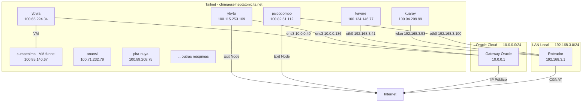

# Topologia de Rede

A rede do homelab é **baseada na Tailnet** — a Tailscale é o backbone principal. IPs locais (LAN) existem mas são secundários, usados apenas para acesso físico quando necessário.

## Contexto de Conectividade

| Servidor | Localização | NAT | Acesso direto | Como alcança a Tailnet | Shell padrão |
|---|---|---|---|---|---|
| psicopompo | Casa | **CGNAT** | ❌ Nenhum | Tailscale (conexão direta ou DERP relay) | **fish** (`/bin/fish`; zsh/bash também instalados) |
| kuaray | Casa | **CGNAT** | ❌ Nenhum | Tailscale (conexão direta ou DERP relay) | bash |
| kavure | Casa | **CGNAT** | ❌ Nenhum | Tailscale (conexão direta ou DERP relay; via extensor Wi-Fi) | bash |
| ybytu | Oracle Cloud | IP Público | ✅ SSH direto | Tailscale (conexão direta) | bash |
| ybyra | Oracle Cloud | IP Público | ✅ SSH direto | Tailscale (conexão direta) | bash |

Ambos psicopompo, kuaray e kavure estão atrás de CGNAT (Carrier-Grade NAT) — não têm IP público roteável. A Tailscale é o **único meio de acesso** externo a esses servidores.

## Diagrama — Tailnet como Rede Principal



> **Linhas sólidas** = conexão física. **Linhas tracejadas** = conexão Tailscale.

## Tabela de IPs

| Hostname | Tailscale IP (primário) | LAN IP (referência) | Interface |
|---|---|---|---|---|
| psicopompo | `100.82.51.112` | `192.168.3.100/24` | eno1 |
| ybytu | `100.115.253.109` | `10.0.0.136/24` | ens3 |
| ybyra | `100.66.224.34` | `10.0.0.40/24` | ens3 |
| kuaray | `100.94.209.99` | `192.168.3.53/24` | wlp6s0 |
| kavure | `100.124.146.77` | `192.168.3.41/24` | eno1 |
| sumaenima | `100.85.140.67` | (nó Tailscale do tunnel container no ybyra) | — |

> **sumaenima** = nó Tailscale do **container `sae-edge_tunnel`** (TS_HOSTNAME=sumaenima) rodando no ybyra — usado para o Tailscale Funnel da Borda Primária. Não é uma VM separada; o IP muda se o tunnel for recriado.
> **Todo o tráfego entre serviços usa IPs da Tailnet.** IPs locais só são usados para acesso físico à máquina.

## Subredes Docker (redes internas dos servidores)

### Psicopompo
| Rede Docker | Subnet | Serviços |
|---|---|---|
| `sumaenimahub_default` | 172.18.0.0/16 | StênioBOT (dev) |
| `minecraftserver_default` | 172.19.0.0/16 | Crafty |
| `rustdesk-server_default` | 172.20.0.0/16 | RustDesk |
| `glances_default` | 172.21.0.0/16 | Glances |
| `winboat_default` | 172.22.0.0/16 | (inativo) |
| `bridge` | 172.17.0.0/16 | Portainer, Umami |
| `sumaenima_sumaenima-net` | overlay | GPU workers (vision/audio/ollama) → Swarm do kavure |

### Ybytu
| Rede Docker | Subnet | Serviços |
|---|---|---|
| `bridge` | 172.17.0.0/16 | AdGuard, Glances, Watchtower, etc |
| `homepage_default` | 172.18.0.0/16 | Homepage |
| `syncthing_default` | 172.21.0.0/16 | Syncthing |
| `filestash_default` | — | (inativo) |
| `nginx-proxy-manager_default` | — | (inativo) |

### Kuaray
| Rede Docker | Subnet | Serviços |
|---|---|---|
| `bridge` | 172.17.0.0/16 | *arr stack, streaming, etc |
| `big-bear-vert_default` | — | Vert |

### Kavure
| Rede Docker | Subnet | Serviços |
|---|---|---|
| `zomboid_default` | 172.18.0.0/16 | pz-server, zomboid-panel |
| `dockerproxy_default` | 172.19.0.0/16 | dockerproxy |
| `sumaenima_sumaenima-net` | overlay | **Swarm manager + core** (sae-core: db, valkey, api, umami-db, backup, asciline) |

## Topologia de Armazenamento

### Psicopompo — 4+ discos + Google Drive
| Disco | Device | Formato | Ponto de Montagem | Tamanho | Uso |
|---|---|---|---|---|---|
| NVMe Sistema | `/dev/nvme1n1p2` | Btrfs | `/` (subvolumes) | 462 GB | 33% — SO + Docker volumes |
| NVMe PCIe | `/dev/nvme0n1p5` | Btrfs | `/mnt/NVME_PCI` | 1.7 TB | 25% — Dados pesados + Windows (99 GB NTFS) |
| SSD SATA | `/dev/sda1` | Btrfs | `/mnt/SSD_SATA` | 448 GB | 10% — Cache / jogos |
| HDD | `/dev/sdb1` | Btrfs | `/mnt/HDD_SATA` | 932 GB | — Mídia / backup (não montado) |
| Disco Windows 1 | `/dev/sdc1` | exFAT | (não montado) | 116 GB | — Possível disco Windows |
| Disco Windows 2 | `/dev/sdd1` | exFAT | (não montado) | 119 GB | — Possível disco Windows |
| Google Drive | `gdrive: (rclone)` | FUSE | `/home/edu/Google_Drive` | 5 TB | 24% — Cloud storage |

### Kuaray — 2 discos
| Disco | Device | Formato | Ponto de Montagem | Tamanho | Uso |
|---|---|---|---|---|---|
| SSD Sistema | `/dev/sda2` | Ext4 | `/` | 224 GB | 23% — SO + Docker |
| HDD Storage | `/dev/sdb1` | Ext4 | `/mnt/storage` | 932 GB | 34% — Bibliotecas multimídia |

### Ybytu — 1 disco
| Disco | Device | Formato | Tamanho | Uso |
|---|---|---|---|---|
| Block Volume | `/dev/sda1` | Ext4 | 50 GB | 17% — Sistema + Docker |

### Ybyra — 1 disco
| Disco | Device | Formato | Tamanho | Uso |
|---|---|---|---|---|
| Boot Volume | `/dev/sda1` | Ext4 | 150 GB | 2% — Sistema + Docker + Filebrowser + Syncthing

### Kavure — 1 disco (LVM expandido em 06/08/2026)
| Disco | Device | Formato | Ponto de Montagem | Tamanho | Uso |
|---|---|---|---|---|---|
| SSD Sistema | `/dev/sda3` | LVM ext4 | `/` (LV único) | 223 GB | — SO + Docker + dados de jogo (`/srv/data/zomboid`) |

## Fluxo de Tráfego

| Origem → Destino | Caminho |
|---|---|---|
| Usuário → Sumænimá (SPA Frontend) | HTTP → **ybyra** (Borda primária, porta 80) — standby: **kavure** (`proxy-standby`, ativado em failover; kuaray **DEPRECIADO** 29/08) |
| SPA Frontend → API | Proxy reverso Nginx (ybyra) → **kavure** (porta 9090, via overlay Swarm) |
| GPU workers → API/Valkey | overlay `sumaenima_sumaenima-net` → kavure |
| Celular (4G) → Home Assistant | Tailscale Funnel → kuaray |
| Celular (4G) → aiostreams | Tailscale Funnel → **kavure** |
| Notebook → AdGuard admin | Tailscale direto → ybytu :3000 |
| Notebook → Portainer | Tailscale direto → psicopompo :9000 |
| Serviço → Internet (exit node) | Serviço → psicopompo ou ybytu → Internet |
| ybytu → Corações / Atualizações | `ens3` → Oracle gateway → Internet |
| ybyra → Atualizações | `ens3` → Oracle gateway → Internet |

## Firewall / Portas Abertas

> Todas as portas abaixo são acessíveis **apenas via Tailscale**, exceto onde indicado.

### Psicopompo
| Porta | Serviço | Acesso |
|---|---|---|
| 22 | SSH | LAN + Tailscale |
| 25565 | Minecraft | LAN + Tailscale |
| 9000 | Portainer | Tailscale |
| 11434 | Ollama (GPU worker) | Tailscale |
| 21115-21117 | RustDesk | Público (não passa pela Tailnet) |
| 8384 | Syncthing | Tailscale |

### Ybytu (Oracle Cloud — firewall do security list)
| Porta | Serviço | Acesso |
|---|---|---|
| 22 | SSH | Tailscale |
| 53 | AdGuard DNS | Tailscale |
| 3000 | AdGuard admin | Tailscale |
| 3001 | Homepage | Tailscale |
| 8334 | Filebrowser | Tailscale |
| 2375 | Docker proxy | Tailscale |

### Ybyra (Oracle Cloud — firewall do security list)
| Porta | Serviço | Acesso |
|---|---|---|
| 22 | SSH | Tailscale |
| 80 | Nginx (Borda Primária - SPA) | Tailscale |
| 61208 | Glances | Tailscale |
| 8334 | Filebrowser | Tailscale |
| 8384 | Syncthing admin | Tailscale |
| 22000 | Syncthing transfer | Tailscale |

### Kuaray
| Porta | Serviço | Acesso |
|---|---|---|
| 22 | SSH | LAN + Tailscale |
| 53 | Pi-hole DNS | LAN |
| 139, 445 | Samba | LAN |
| 1883 | MQTT | LAN + Docker |
| 8085 | Nginx (Borda Secundária - SPA) | ~~Deprecado 29/08~~ — kuaray saiu do papel; standby agora é `proxy-standby` no **kavure** (sem porta publicada, serve via overlay/failover) |
| 8123 | Home Assistant | Tailscale + Funnel |
| 3000 | aiostreams | Tailscale + Funnel |
| 10000 | Funnel HA | **Público** (via Tailscale Funnel) |
| 8443 | Funnel aiostreams | **Público** (via Tailscale Funnel) |

### Kavure
| Porta | Serviço | Acesso |
|---|---|---|
| 22 | SSH | LAN + Tailscale |
| 16261 | Project Zomboid (game) | Tailscale |
| 16262 | Project Zomboid (direct) | Tailscale |
| 27015 | Project Zomboid (RCON) | Tailscale |
| 3001 | Zomboid Control Panel | Tailscale |
| 61208 | Glances | Tailscale |
| 2375 | Docker proxy (homepage) | Tailscale |
| 9090 | Sumænimá Backend API (core) | Tailscale |
| 9092 | Sumænimá Backup health | Tailscale |

## Como Acessar Cada Serviço

Pela Tailnet (qualquer máquina na tailscale):
```
http://sumaenima.chimaera-heptatonic.ts.net           → Sumænimá (SPA Frontend - Borda Primária)
http://ybyra.chimaera-heptatonic.ts.net               → Sumænimá (SPA Frontend - Borda Primária)
http://kuaray.chimaera-heptatonic.ts.net:8085         → ~~Sumænimá (SPA Frontend - Borda Secundária)~~ — DEPRECIADO; standby: kavure `proxy-standby` + `tunnel-standby` (failover)
http://psicopompo.chimaera-heptatonic.ts.net:9000     → Portainer
http://ybytu.chimaera-heptatonic.ts.net:3001          → Homepage
http://kuaray.chimaera-heptatonic.ts.net:8123         → Home Assistant
http://kavure.chimaera-heptatonic.ts.net:3001         → Zomboid Control Panel
http://kavure.chimaera-heptatonic.ts.net:16261        → Project Zomboid (game)
http://kavure.chimaera-heptatonic.ts.net:61208        → Glances
```

Publicamente (via Funnel):
```
https://kuaray.chimaera-heptatonic.ts.net:10000       → Home Assistant
https://kavure.chimaera-heptatonic.ts.net:8443        → aiostreams
```

## Observações

- **CGNAT**: psicopompo e kuaray compartilham IP público com outros clientes da operadora — sem Tailscale seriam inacessíveis remotamente
- **Ybytu** e **ybyra** têm IP público (Oracle Cloud) e poderiam ser acessados diretamente, mas todo o tráfego de gestão passa pela Tailscale por segurança
- **DERP relays** são usados como fallback quando a conexão direta Tailscale não é possível
- **Roteador** em `192.168.3.1` — sem VLANs configuradas atualmente
- **Ybytu** usa MTU 9000 (Jumbo Frames) na interface Oracle
- **Psicopompo** usa Btrfs com subvolumes
- Docker proxy (`:2375`) exposto apenas via Tailscale
