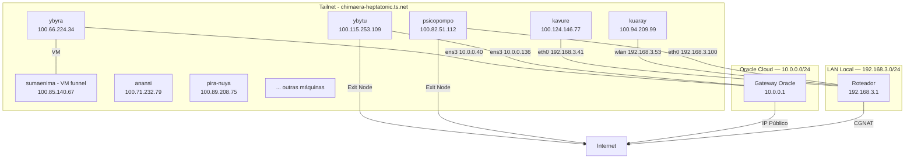

# Network Topology

The homelab network is **built on the Tailnet** — Tailscale is the main backbone. Local (LAN) IPs exist but are secondary, used only for physical access when needed.

## Connectivity Context

| Server | Location | NAT | Direct access | How it reaches the Tailnet | Default shell |
|---|---|---|---|---|---|
| psicopompo | House | **CGNAT** | ❌ None | Tailscale (direct connection or DERP relay) | **fish** (`/bin/fish`; zsh/bash also installed) |
| kuaray | House | **CGNAT** | ❌ None | Tailscale (direct connection or DERP relay) | bash |
| kavure | House | **CGNAT** | ❌ None | Tailscale (direct connection or DERP relay; via Wi-Fi extender) | bash |
| ybytu | Oracle Cloud | Public IP | ✅ Direct SSH | Tailscale (direct connection) | bash |
| ybyra | Oracle Cloud | Public IP | ✅ Direct SSH | Tailscale (direct connection) | bash |

psicopompo, kuaray and kavure are all behind CGNAT (Carrier-Grade NAT) — they have no routable public IP. Tailscale is the **only external access path** to those servers.

## Diagram — Tailnet as the Main Network



> **Solid lines** = physical connection. **Dashed lines** = Tailscale connection.

## IP Table

| Hostname | Tailscale IP (primary) | LAN IP (reference) | Interface |
|---|---|---|---|---|
| psicopompo | `100.82.51.112` | `192.168.3.100/24` | eno1 |
| ybytu | `100.115.253.109` | `10.0.0.136/24` | ens3 |
| ybyra | `100.66.224.34` | `10.0.0.40/24` | ens3 |
| kuaray | `100.94.209.99` | `192.168.3.53/24` | wlp6s0 |
| kavure | `100.124.146.77` | `192.168.3.41/24` | eno1 |
| sumaenima | `100.85.140.67` | (Tailscale node of the tunnel container on ybyra) | — |

> **sumaenima** = Tailscale node of the **`sae-edge_tunnel` container** (TS_HOSTNAME=sumaenima) running on ybyra — used for the Primary Edge Tailscale Funnel. It is not a separate VM; the IP changes if the tunnel is recreated.
> **All traffic between services uses Tailnet IPs.** Local IPs are only used for physical access to the machine.

## Docker Subnets (internal server networks)

### Psicopompo
| Docker Network | Subnet | Services |
|---|---|---|
| `sumaenimahub_default` | 172.18.0.0/16 | StênioBOT (dev) |
| `minecraftserver_default` | 172.19.0.0/16 | Crafty |
| `rustdesk-server_default` | 172.20.0.0/16 | RustDesk |
| `glances_default` | 172.21.0.0/16 | Glances |
| `winboat_default` | 172.22.0.0/16 | (inactive) |
| `bridge` | 172.17.0.0/16 | Portainer, Umami |
| `sumaenima_sumaenima-net` | overlay | GPU workers (vision/audio/ollama) → kavure's Swarm |

### Ybytu
| Docker Network | Subnet | Services |
|---|---|---|
| `bridge` | 172.17.0.0/16 | AdGuard, Glances, Watchtower, etc |
| `homepage_default` | 172.18.0.0/16 | Homepage |
| `syncthing_default` | 172.21.0.0/16 | Syncthing |
| `filestash_default` | — | (inactive) |
| `nginx-proxy-manager_default` | — | (inactive) |

### Kuaray
| Docker Network | Subnet | Services |
|---|---|---|
| `bridge` | 172.17.0.0/16 | *arr stack, streaming, etc |
| `big-bear-vert_default` | — | Vert |

### Kavure
| Docker Network | Subnet | Services |
|---|---|---|
| `zomboid_default` | 172.18.0.0/16 | pz-server, zomboid-panel |
| `dockerproxy_default` | 172.19.0.0/16 | dockerproxy |
| `sumaenima_sumaenima-net` | overlay | **Swarm manager + core** (sae-core: db, valkey, api, umami-db, backup, asciline) |

## Storage Topology

### Psicopompo — 4+ disks + Google Drive
| Disk | Device | Format | Mount Point | Size | Usage |
|---|---|---|---|---|---|
| NVMe System | `/dev/nvme1n1p2` | Btrfs | `/` (subvolumes) | 462 GB | 33% — OS + Docker volumes |
| NVMe PCIe | `/dev/nvme0n1p5` | Btrfs | `/mnt/NVME_PCI` | 1.7 TB | 25% — Heavy data + Windows (99 GB NTFS) |
| SATA SSD | `/dev/sda1` | Btrfs | `/mnt/SSD_SATA` | 448 GB | 10% — Cache / games |
| HDD | `/dev/sdb1` | Btrfs | `/mnt/HDD_SATA` | 932 GB | — Media / backup (not mounted) |
| Windows Disk 1 | `/dev/sdc1` | exFAT | (not mounted) | 116 GB | — Possible Windows disk |
| Windows Disk 2 | `/dev/sdd1` | exFAT | (not mounted) | 119 GB | — Possible Windows disk |
| Google Drive | `gdrive: (rclone)` | FUSE | `/home/edu/Google_Drive` | 5 TB | 24% — Cloud storage |

### Kuaray — 2 disks
| Disk | Device | Format | Mount Point | Size | Usage |
|---|---|---|---|---|---|
| System SSD | `/dev/sda2` | Ext4 | `/` | 224 GB | 23% — OS + Docker |
| HDD Storage | `/dev/sdb1` | Ext4 | `/mnt/storage` | 932 GB | 34% — Media libraries |

### Ybytu — 1 disk
| Disk | Device | Format | Size | Usage |
|---|---|---|---|---|
| Block Volume | `/dev/sda1` | Ext4 | 50 GB | 17% — System + Docker |

### Ybyra — 1 disk
| Disk | Device | Format | Size | Usage |
|---|---|---|---|---|
| Boot Volume | `/dev/sda1` | Ext4 | 150 GB | 2% — System + Docker + Filebrowser + Syncthing

### Kavure — 1 disk (LVM expanded on 06/08/2026)
| Disk | Device | Format | Mount Point | Size | Usage |
|---|---|---|---|---|---|
| System SSD | `/dev/sda3` | LVM ext4 | `/` (single LV) | 223 GB | — OS + Docker + game data (`/srv/data/zomboid`) |

## Traffic Flow

| Source → Destination | Path |
|---|---|---|
| User → Sumænimá (SPA Frontend) | HTTP → **ybyra** (primary edge, port 80) — standby: **kavure** (`proxy-standby`, enabled on failover; kuaray **DEPRECATED** 29/08) |
| SPA Frontend → API | Nginx reverse proxy (ybyra) → **kavure** (port 9090, via Swarm overlay) |
| GPU workers → API/Valkey | overlay `sumaenima_sumaenima-net` → kavure |
| Phone (4G) → Home Assistant | Tailscale Funnel → kuaray |
| Phone (4G) → aiostreams | Tailscale Funnel → **kavure** |
| Laptop → AdGuard admin | Direct Tailscale → ybytu :3000 |
| Laptop → Portainer | Direct Tailscale → psicopompo :9000 |
| Service → Internet (exit node) | Service → psicopompo or ybytu → Internet |
| ybytu → Hearts / Updates | `ens3` → Oracle gateway → Internet |
| ybyra → Updates | `ens3` → Oracle gateway → Internet |

## Firewall / Open Ports

> All ports below are reachable **via Tailscale only**, except where noted.

### Psicopompo
| Port | Service | Access |
|---|---|---|
| 22 | SSH | LAN + Tailscale |
| 25565 | Minecraft | LAN + Tailscale |
| 9000 | Portainer | Tailscale |
| 11434 | Ollama (GPU worker) | Tailscale |
| 21115-21117 | RustDesk | Public (does not go through the Tailnet) |
| 8384 | Syncthing | Tailscale |

### Ybytu (Oracle Cloud — security list firewall)
| Port | Service | Access |
|---|---|---|
| 22 | SSH | Tailscale |
| 53 | AdGuard DNS | Tailscale |
| 3000 | AdGuard admin | Tailscale |
| 3001 | Homepage | Tailscale |
| 8334 | Filebrowser | Tailscale |
| 2375 | Docker proxy | Tailscale |

### Ybyra (Oracle Cloud — security list firewall)
| Port | Service | Access |
|---|---|---|
| 22 | SSH | Tailscale |
| 80 | Nginx (Primary Edge - SPA) | Tailscale |
| 61208 | Glances | Tailscale |
| 8334 | Filebrowser | Tailscale |
| 8384 | Syncthing admin | Tailscale |
| 22000 | Syncthing transfer | Tailscale |

### Kuaray
| Port | Service | Access |
|---|---|---|
| 22 | SSH | LAN + Tailscale |
| 53 | Pi-hole DNS | LAN |
| 139, 445 | Samba | LAN |
| 1883 | MQTT | LAN + Docker |
| 8085 | Nginx (Secondary Edge - SPA) | ~~Deprecated 29/08~~ — kuaray is out of the role; standby is now `proxy-standby` on **kavure** (no published port, serves via overlay/failover) |
| 8123 | Home Assistant | Tailscale + Funnel |
| 3000 | aiostreams | Tailscale + Funnel |
| 10000 | Funnel HA | **Public** (via Tailscale Funnel) |
| 8443 | Funnel aiostreams | **Public** (via Tailscale Funnel) |

### Kavure
| Port | Service | Access |
|---|---|---|
| 22 | SSH | LAN + Tailscale |
| 16261 | Project Zomboid (game) | Tailscale |
| 16262 | Project Zomboid (direct) | Tailscale |
| 27015 | Project Zomboid (RCON) | Tailscale |
| 3001 | Zomboid Control Panel | Tailscale |
| 61208 | Glances | Tailscale |
| 2375 | Docker proxy (homepage) | Tailscale |
| 8444 | Crafty Controller (Minecraft web) | Tailscale |
| 25565 | Minecraft Server (Java/Fabric) | Tailscale |
| 9090 | Sumænimá Backend API (core) | Tailscale |
| 9092 | Sumænimá Backup health | Tailscale |

## How to Access Each Service

Over the Tailnet (any machine on the tailnet):
```
http://sumaenima.chimaera-heptatonic.ts.net           → Sumænimá (SPA Frontend - Borda Primária)
http://ybyra.chimaera-heptatonic.ts.net               → Sumænimá (SPA Frontend - Borda Primária)
http://kuaray.chimaera-heptatonic.ts.net:8085         → ~~Sumænimá (SPA Frontend - Borda Secundária)~~ — DEPRECIADO; standby: kavure `proxy-standby` + `tunnel-standby` (failover)
http://psicopompo.chimaera-heptatonic.ts.net:9000     → Portainer
http://ybytu.chimaera-heptatonic.ts.net:3001          → Homepage
http://kavure.chimaera-heptatonic.ts.net:8123         → Home Assistant
http://kavure.chimaera-heptatonic.ts.net:3001         → Zomboid Control Panel
http://kavure.chimaera-heptatonic.ts.net:16261        → Project Zomboid (game)
https://kavure.chimaera-heptatonic.ts.net:8444        → Crafty Controller (Minecraft)
http://kavure.chimaera-heptatonic.ts.net:4533         → Navidrome (Música)
http://kavure.chimaera-heptatonic.ts.net:8083         → Calibre-web Automated (Ebooks)
http://kavure.chimaera-heptatonic.ts.net:61208        → Glances
```

Publicly (via Funnel):
```
https://kavure.chimaera-heptatonic.ts.net:10000       → aiostreams
```

## Notes

- **CGNAT**: psicopompo and kuaray share a public IP with other ISP customers — without Tailscale they would be unreachable remotely
- **Ybytu** and **ybyra** have a public IP (Oracle Cloud) and could be accessed directly, but all management traffic goes through Tailscale for security
- **DERP relays** are used as a fallback when a direct Tailscale connection is not possible
- **Router** at `192.168.3.1` — no VLANs configured currently
- **Ybytu** uses MTU 9000 (Jumbo Frames) on the Oracle interface
- **Psicopompo** uses Btrfs with subvolumes
- Docker proxy (`:2375`) exposed via Tailscale only
