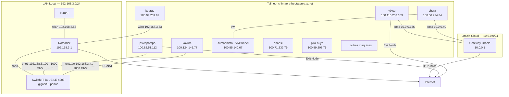

# Topologia de Rede

A rede do homelab é **baseada na Tailnet** — a Tailscale é o backbone principal. IPs locais (LAN) existem mas são secundários, usados apenas para acesso físico quando necessário.

## Contexto de Conectividade

| Servidor | Localização | NAT | Acesso direto | Como alcança a Tailnet | Shell padrão |
|---|---|---|---|---|---|
| psicopompo | Casa | **CGNAT** | ❌ Nenhum | Tailscale (conexão direta ou DERP relay) | **fish** (`/bin/fish`; zsh/bash também instalados) |
| kuaray | Casa | **CGNAT** | ❌ Nenhum | Tailscale (conexão direta ou DERP relay) | bash |
| kavure | Casa | **CGNAT** | ❌ Nenhum | Tailscale (conexão direta ou DERP relay) | bash |
| ybytu | Oracle Cloud | IP Público | ✅ SSH direto | Tailscale (conexão direta) | bash |
| ybyra | Oracle Cloud | IP Público | ✅ SSH direto | Tailscale (conexão direta) | bash |
| kururu | Casa | **CGNAT** | ❌ Nenhum | Wi-Fi LAN + Tailscale | ash / sh (Alpine) |

Ambos psicopompo, kuaray e kavure estão atrás de CGNAT (Carrier-Grade NAT) — não têm IP público roteável. A Tailscale é o **único meio de acesso** externo a esses servidores.

## Diagrama — Tailnet como Rede Principal


```mermaid
graph TB
    internet[Internet]

    subgraph tailnet[Tailnet - chimaera-heptatonic.ts.net]
        psicopompo[psicopompo<br>100.82.51.112]
        kuaray[kuaray<br>100.94.209.99]
        ybytu[ybytu<br>100.115.253.109]
        ybyra[ybyra<br>100.66.224.34]
        kavure[kavure<br>100.124.146.77]
        sumaenima[sumaenima - VM funnel<br>100.85.140.67]
        anansi[anansi<br>100.71.232.79]
        pira_nuya[pira-nuya<br>100.89.208.75]
        outras[... outras máquinas]
    end

    subgraph lan[LAN Local — 192.168.3.0/24]
        roteador[Roteador<br>192.168.3.1]
        switch[Switch IT-BLUE LE-4203<br>gigabit 8 portas]
        roteador ---|cabo| switch
        psicopompo ---|eno1 192.168.3.100 · 1000 Mb/s| switch
        kavure ---|enp1s0 192.168.3.41 · 1000 Mb/s| switch
        kuaray ---|wlan 192.168.3.53| roteador
        kururu ---|wlan 192.168.3.55| roteador
    end

    subgraph oracle[Oracle Cloud — 10.0.0.0/24]
        ybytu ---|ens3 10.0.0.136| oracle_gw[Gateway Oracle<br>10.0.0.1]
        ybyra ---|ens3 10.0.0.40| oracle_gw
        ybyra ---|VM| sumaenima
    end

    roteador -->|CGNAT| internet
    oracle_gw -->|IP Público| internet

    psicopompo -->|Exit Node| internet
    ybytu -->|Exit Node| internet
```

> **Linhas sólidas** = conexão física. **Linhas tracejadas** = conexão Tailscale.

## Link Físico — Switch Gigabit `IT-BLUE LE-4203` (02/10/2026)

Até 02/10/2026 só o psicopompo era cabeado — o kavure chegava pela rede via
**extensor/repetidor Wi-Fi**. Com a migração para cabeamento novo, os dois hosts
passaram a ficar atrás de um switch gigabit de 8 portas:

```
Internet → Roteador (192.168.3.1) ⇄ switch IT-BLUE LE-4203 ⇄ { psicopompo, kavure }
```

### Ficha técnica

| Item | Valor |
|---|---|
| Marca / Modelo | **IT-BLUE** (It-Blue) · **LE-4203** |
| Portas | 8 × RJ45 **10/100/1000 Mbps**, auto MDI/MDIX |
| Capacidade de comutação | **16 Gbps** (full-duplex: 8 × 1 Gbps × 2) |
| Taxa de encaminhamento | **11,52 Mpps** (≈97% da taxa de linha teórica de 11,9 Mpps) |
| Gerenciamento | **Não administrável** — sem VLAN/QoS/ACL, *plug and play* |
| Energia | Bivolt · sem ventoinha · ~0,3 kg |

> Referência de preço: **R$ 115** ([Multimídia Informática](https://multimidia.inf.br/produtos/switch-8-portas-gigabit-it-blue-le-4203-xl8u6/) — página consultada em 02/10/2026; ficha técnica sem manual público, especificações acima confirmadas pelo rótulo/caixa).

### Validação: o switch é mesmo gigabit? (02/10/2026)

| Verificação | Resultado |
|---|---|
| Negotiation — psicopompo `eno1` | **1000 Mb/s, full-duplex** |
| Negotiation — kavure `enp1s0` | **1000 Mb/s, full-duplex** |
| Latência LAN (`ping 192.168.3.41`) | **0,17 – 0,28 ms** |
| Throughput raw — upload (1 GiB) | **111 MiB/s ≈ 912 Mbps** |
| Throughput raw — download (1 GiB) | **102 MiB/s ≈ 858 Mbps** |
| **Conclusão** | **✅ gigabit confirmado** — 93% da taxa de linha teórica |

### Método reproduzível (sem dependências)

O `iperf3` não estava instalado em nenhum dos dois hosts, então o teste foi feito com
`nc` + `dd` — **zero instalação**, resultado igualmente válido:

```bash
# 1. link/speed (qualquer um dos hosts)
ethtool eno1 | grep -E 'Speed|Duplex'     # psicopompo
ethtool enp1s0 | grep -E 'Speed|Duplex'   # kavure

# 2. latência
ping -c 20 192.168.3.41

# 3. throughput — servidor (kavure)
nc -lk5202 > /dev/null

# 4. throughput — cliente (psicopompo), 1 GiB de upload
dd if=/dev/zero bs=1M count=1024 | pv -r | nc -q5 192.168.3.41 5202
```

- `iperf3` continua sendo a ferramenta padrão do setor caso se queira um número com
  CPU ociosa — mas não é necessário para validar velocidade de link.
- **Limpeza obrigatória:** mate os listeners `nc` ao terminar (`pkill nc`), senão a
  porta fica presa.

### Observações

- **Não administrável** ⇒ não há como travar velocidade nem criar VLAN no switch; a
  negociação é automática. Se um dia o link cair para 100 Mb/s, o suspeito é o cabo
  ou a porta — conferir com `ethtool`.
- **Broadcast domain único** (sem VLAN): o **Magic Packet de Wake-on-LAN** propaga
  normalmente pelo switch — **validado em 02/10/2026 nos dois sentidos** (kavure
  acorda em **29s**, psicopompo em **54s**), melhoria direta em relação ao caminho
  antigo via extensor Wi-Fi. Ver [`services/wol-relay.md`](../services/wol-relay.md).
- **Uso das portas:** psicopompo e kavure; **6 portas livres** para expansão.

## Tabela de IPs

| Hostname | Tailscale IP (primário) | LAN IP (referência) | Interface |
|---|---|---|---|---|
| psicopompo | `100.82.51.112` | `192.168.3.100/24` | eno1 |
| ybytu | `100.115.253.109` | `10.0.0.136/24` | ens3 |
| ybyra | `100.66.224.34` | `10.0.0.40/24` | ens3 |
| kuaray | `100.94.209.99` | `192.168.3.53/24` | wlp6s0 |
| kavure | `100.124.146.77` | `192.168.3.41/24` | enp1s0 |
| sumaenima | `100.85.140.67` | (nó Tailscale do tunnel container no ybyra) | — |

> **sumaenima** = nó Tailscale do **container `sae-edge_tunnel`** (TS_HOSTNAME=sumaenima) rodando no ybyra — usado para o Tailscale Funnel da Borda Primária. Não é uma VM separada; o IP muda se o tunnel for recriado.
> **Todo o tráfego entre serviços usa IPs da Tailnet.** IPs locais só são usados para acesso físico à máquina.

## Subredes Docker (redes internas dos servidores)

### Psicopompo

> **Conferido via `docker network inspect` em 02/10/2026.** Duas redes da versão anterior
> **não existem mais** (`sumaenimahub_default`, `minecraftserver_default` — stacks migradas
> para o kavure) e o **Portainer foi removido** (vivia na `bridge` junto com o Umami, que
> também migrou).

| Rede Docker | Subnet | Serviços (containers reais) |
|---|---|---|
| `bridge` | 172.17.0.0/16 | autoheal, glances, dockerproxy, watchtower |
| `registry_default` | 172.25.0.0/16 | registry (`:5000`) |
| `sae-net` (overlay Swarm) | 10.0.2.0/24 · **MTU 1280** (vxlan 4099) | steniorec (worker GPU) + GPU workers vision/audio/ollama → Swarm do kavure |
| `host` | — | promtail, node-exporter |
| `docker_gwbridge` | 172.24.0.0/16 | gateways do Swarm (ingress / attachable) |
| `ingress` (overlay) | 10.0.0.0/24 | ingress do Swarm |
| `promtail_default` | 172.18.0.0/16 | *(vazia — promtail usa `host`)* |
| `glances_default` | 172.19.0.0/16 | *(vazia — glances agora na `bridge`)* |
| `transcribe_default` | 172.21.0.0/16 | *(vazia)* |
| `rustdesk-server_default` | 172.22.0.0/16 | *(vazia — RustDesk removido 2026)* |
| `umami_net` | 172.23.0.0/16 | *(vazia — umami migrou p/ kavure)* |
| `winboat_default` | 172.20.0.0/16 | *(vazia/inativo)* |

### Ybytu
| Rede Docker | Subnet | Serviços |
|---|---|---|
| `bridge` | 172.17.0.0/16 | AdGuard, Glances, Watchtower, etc |
| `homepage_default` | 172.18.0.0/16 | Homepage |
| `syncthing_default` | 172.21.0.0/16 | Syncthing |
| `filestash_default` | — | (inativo) |
| `nginx-proxy-manager_default` | — | (inativo) |

### Kuaray
| Rede Docker | Subnet | Serviços |
|---|---|---|
| `bridge` | 172.17.0.0/16 | *arr stack, streaming, etc |
| `big-bear-vert_default` | — | Vert |

### Kavure
| Rede Docker | Subnet | Serviços |
|---|---|---|
| `zomboid_default` | 172.18.0.0/16 | pz-server, zomboid-panel |
| `dockerproxy_default` | 172.19.0.0/16 | dockerproxy |
| `sae-net` | 10.0.2.0/24 · **MTU 1280** | **Swarm manager + core** (sae-core: db, valkey, api, umami-db, backup, asciline) |

> **Overlay `sae-net` — MTU 1280 (corrigido 29/09/2026).** O Docker entrega pacotes de
> até 1500 bytes por padrão, mas o caminho Tailscale (`tailscale0`, WireGuard) só aceita
> **1280** — o excedente é **descartado em silêncio**, travando payloads grandes
> (imagens do Arandu via ybyra, anexos, respostas grandes). A correção é no **driver da
> rede** (`--opt com.docker.network.driver.mtu=1280`), **nunca** no flag
> `--network-control-plane-mtu` do daemon (que só afeta o control plane e **derruba o
> nó** abaixo de 1500 — tentado e revertido no mesmo dia).
>
> A migração foi **rolada, sem downtime** (`service update --network-add/--network-rm`),
> como manda a documentação oficial da Docker. O nome anterior
> (`sumaenima_sumaenima-net`) era legado de um projeto compose que não existe mais.
>
> **Runbook completo** (com links oficiais): `docs/swarm-tailscale-troubleshooting.md`
> no repositório Sumænimá Hub.

> ⚠️ **Pendência conhecida:** a rede antiga `sumaenima_sumaenima-net` (subnet 10.0.1.0/24)
> **continua existindo no kavure**, sem nenhum serviço conectado, bloqueada por uma
> *task fantasma* do swarm (`in use by task …`). A remoção exige **reiniciar o dockerd
> do kavure** (janela agendada). Ver §4 do runbook.

## Topologia de Armazenamento

### Psicopompo — 4+ discos + Google Drive
| Disco | Device | Formato | Ponto de Montagem | Tamanho | Uso |
|---|---|---|---|---|---|
| NVMe Sistema | `/dev/nvme1n1p2` | Btrfs | `/` (subvolumes) | 462 GB | 33% — SO + Docker volumes |
| NVMe PCIe | `/dev/nvme0n1p5` | Btrfs | `/mnt/NVME_PCI` | 1.7 TB | 25% — Dados pesados + Windows (99 GB NTFS) |
| SSD SATA | `/dev/sda1` | Btrfs | `/mnt/SSD_SATA` | 448 GB | 10% — Cache / jogos |
| HDD | `/dev/sdb1` | Btrfs | `/mnt/HDD_SATA` | 932 GB | — Mídia / backup (não montado) |
| Disco Windows 1 | `/dev/sdc1` | exFAT | (não montado) | 116 GB | — Possível disco Windows |
| Disco Windows 2 | `/dev/sdd1` | exFAT | (não montado) | 119 GB | — Possível disco Windows |
| Google Drive | `gdrive: (rclone)` | FUSE | `/home/edu/Google_Drive` | 5 TB | 24% — Cloud storage |

### Kuaray — 2 discos
| Disco | Device | Formato | Ponto de Montagem | Tamanho | Uso |
|---|---|---|---|---|---|
| SSD Sistema | `/dev/sda2` | Ext4 | `/` | 224 GB | 23% — SO + Docker |
| HDD Storage | `/dev/sdb1` | Ext4 | `/mnt/storage` | 932 GB | 34% — Bibliotecas multimídia |

### Ybytu — 1 disco
| Disco | Device | Formato | Tamanho | Uso |
|---|---|---|---|---|
| Block Volume | `/dev/sda1` | Ext4 | 50 GB | 17% — Sistema + Docker |

### Ybyra — 1 disco
| Disco | Device | Formato | Tamanho | Uso |
|---|---|---|---|---|
| Boot Volume | `/dev/sda1` | Ext4 | 150 GB | 2% — Sistema + Docker + Filebrowser + Syncthing

### Kavure — 1 disco (LVM expandido em 06/08/2026)
| Disco | Device | Formato | Ponto de Montagem | Tamanho | Uso |
|---|---|---|---|---|---|
| SSD Sistema | `/dev/sda3` | LVM ext4 | `/` (LV único) | 223 GB | — SO + Docker + dados de jogo (`/srv/data/zomboid`) |

## Fluxo de Tráfego

| Origem → Destino | Caminho |
|---|---|---|
| Usuário → Sumænimá (SPA Frontend) | HTTP → **ybyra** (Borda primária, porta 80) — standby: **kavure** (`proxy-standby`, ativado em failover; kuaray **DEPRECIADO** 29/08) |
| SPA Frontend → API | Proxy reverso Nginx (ybyra) → **kavure** (porta 9090, via overlay Swarm) |
| GPU workers → API/Valkey | overlay `sae-net` → kavure |
| Celular (4G) → Home Assistant | Tailscale Funnel → kuaray |
| Celular (4G) → aiostreams | Tailscale Funnel → **kavure** |
| Notebook → AdGuard admin | Tailscale direto → ybytu :3000 |
| ~~Notebook → Portainer~~ | ~~Tailscale direto → psicopompo :9000~~ — **Portainer removido** (sem substituto web; `docker`/CLI + Homepage) |
| Serviço → Internet (exit node) | Serviço → psicopompo ou ybytu → Internet |
| ybytu → Corações / Atualizações | `ens3` → Oracle gateway → Internet |
| ybyra → Atualizações | `ens3` → Oracle gateway → Internet |

## Firewall / Portas Abertas

> Todas as portas abaixo são acessíveis **apenas via Tailscale**, exceto onde indicado.

### Psicopompo
| Porta | Serviço | Acesso |
|---|---|---|
| 22 | SSH | LAN + Tailscale |
| 25565 | Minecraft | LAN + Tailscale |
| ~~9000~~ | ~~Portainer~~ | **removido** (verificado 02/10/2026: porta fechada, container inexistente) |
| 11434 | Ollama (GPU worker) | Tailscale |
| 21115-21117 | RustDesk | Público (não passa pela Tailnet) |
| 8384 | Syncthing | Tailscale |

### Ybytu (Oracle Cloud — firewall do security list)
| Porta | Serviço | Acesso |
|---|---|---|
| 22 | SSH | Tailscale |
| 53 | AdGuard DNS | Tailscale |
| 3000 | AdGuard admin | Tailscale |
| 3001 | Homepage | Tailscale |
| 8334 | Filebrowser | Tailscale |
| 2375 | Docker proxy | Tailscale |
| 40000 | Tailscale Peer Relay | Tailnet |

### Ybyra (Oracle Cloud — firewall do security list)
| Porta | Serviço | Acesso |
|---|---|---|
| 22 | SSH | Tailscale |
| 80 | Nginx (Borda Primária - SPA) | Tailscale |
| 61208 | Glances | Tailscale |
| 8334 | Filebrowser | Tailscale |
| 8384 | Syncthing admin | Tailscale |
| 22000 | Syncthing transfer | Tailscale |

### Kuaray
| Porta | Serviço | Acesso |
|---|---|---|
| 22 | SSH | LAN + Tailscale |
| 53 | Pi-hole DNS | LAN |
| 139, 445 | Samba | LAN |
| 1883 | MQTT | LAN + Docker |
| 8085 | Nginx (Borda Secundária - SPA) | ~~Deprecado 29/08~~ — kuaray saiu do papel; standby agora é `proxy-standby` no **kavure** (sem porta publicada, serve via overlay/failover) |
| 8123 | Home Assistant | Tailscale + Funnel |
| 3000 | aiostreams | Tailscale + Funnel |
| 10000 | Funnel HA | **Público** (via Tailscale Funnel) |
| 8443 | Funnel aiostreams | **Público** (via Tailscale Funnel) |

### Kavure
| Porta | Serviço | Acesso |
|---|---|---|
| 22 | SSH | LAN + Tailscale |
| 16261 | Project Zomboid (game) | Tailscale |
| 16262 | Project Zomboid (direct) | Tailscale |
| 27015 | Project Zomboid (RCON) | Tailscale |
| 3001 | Zomboid Control Panel | Tailscale |
| 61208 | Glances | Tailscale |
| 2375 | Docker proxy (homepage) | Tailscale |
| 8444 | Crafty Controller (Minecraft web) | Tailscale |
| 25565 | Minecraft Server (Java/Fabric) | Tailscale |
| 9090 | Sumænimá Backend API (core) | **só overlay Swarm** (ver nota) |
| 9092 | Sumænimá Backup health | Tailscale |
| 40000 | Tailscale Peer Relay | Tailnet |

> ⚠️ **Achado 02/10/2026 — porta 9090 não existe no host.** `sae-core_api` está
> publicado **apenas na overlay `sae-net`** (`Endpoint.Ports: null`, VIP `10.0.2.20`);
> `ss -ltn` não mostra 9090 no kavure. O probe
> `http://100.124.146.77:9090/api/health` do **monitor #50** do Uptime Kuma está,
> portanto, **quebrado** (falha de conexão). O caminho real e saudável é pela borda:
> `http://ybyra.chimaera-heptatonic.ts.net/api/health` → **200** (monitor #4).
> Corrigir o monitor #50 (ou publicar a porta) ficou como pendência.

## Como Acessar Cada Serviço

Pela Tailnet (qualquer máquina na tailscale):
```
http://sumaenima.chimaera-heptatonic.ts.net           → Sumænimá (SPA Frontend - Borda Primária)
http://ybyra.chimaera-heptatonic.ts.net               → Sumænimá (SPA Frontend - Borda Primária)
http://kuaray.chimaera-heptatonic.ts.net:8085         → ~~Sumænimá (SPA Frontend - Borda Secundária)~~ — DEPRECIADO; standby: kavure `proxy-standby` + `tunnel-standby` (failover)
http://psicopompo.chimaera-heptatonic.ts.net:9000     → ~~Portainer~~ REMOVIDO (02/10/2026 — porta fechada)
http://ybytu.chimaera-heptatonic.ts.net:3001          → Homepage
http://kavure.chimaera-heptatonic.ts.net:8123         → Home Assistant
http://kavure.chimaera-heptatonic.ts.net:3001         → Zomboid Control Panel
http://kavure.chimaera-heptatonic.ts.net:16261        → Project Zomboid (game)
https://kavure.chimaera-heptatonic.ts.net:8444        → Crafty Controller (Minecraft)
http://kavure.chimaera-heptatonic.ts.net:4533         → Navidrome (Música)
http://kavure.chimaera-heptatonic.ts.net:8083         → Calibre-web Automated (Ebooks)
http://kavure.chimaera-heptatonic.ts.net:61208        → Glances
```

Publicamente (via Funnel):
```
https://kavure.chimaera-heptatonic.ts.net:10000       → aiostreams
```

## Observações

- **CGNAT**: psicopompo e kuaray compartilham IP público com outros clientes da operadora — sem Tailscale seriam inacessíveis remotamente
- **Ybytu** e **ybyra** têm IP público (Oracle Cloud) e poderiam ser acessados diretamente, mas todo o tráfego de gestão passa pela Tailscale por segurança
- **DERP relays** são usados como fallback quando a conexão direta Tailscale não é possível
- **Roteador** em `192.168.3.1` — sem VLANs configuradas atualmente
- **Ybytu** usa MTU 9000 (Jumbo Frames) na interface Oracle
- **Psicopompo** usa Btrfs com subvolumes
- Docker proxy (`:2375`) exposto apenas via Tailscale
