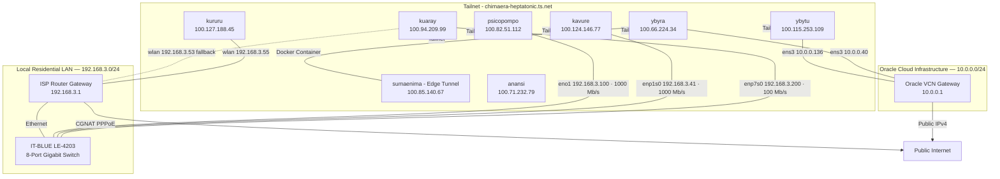

# Network Topology

The homelab architecture is **built entirely upon Tailscale as its primary backbone**. Local LAN IP assignments exist for physical maintenance and initial provisioning, while operational service traffic routes securely through the encrypted Tailnet mesh.

## Connectivity Matrix

| Node | Physical Location | NAT Environment | Direct Inbound WAN | Primary Access Channel | Default Shell |
|---|---|---|---|---|---|
| psicopompo | Home Lab | **CGNAT** | ❌ None | Tailscale (Direct WireGuard or DERP relay) | **fish** (`/bin/fish`; zsh/bash available) |
| kuaray | Home Lab | **CGNAT** | ❌ None | Tailscale (Direct WireGuard or DERP relay) | bash |
| kavure | Home Lab | **CGNAT** | ❌ None | Tailscale (Direct WireGuard or DERP relay) | bash |
| ybytu | Oracle Cloud | Public IP | ✅ Direct SSH | Tailscale (Direct WireGuard) | bash |
| ybyra | Oracle Cloud | Public IP | ✅ Direct SSH | Tailscale (Direct WireGuard) | bash |
| kururu | Home Lab | **CGNAT** | ❌ None | Local Wi-Fi LAN + Tailscale | ash / sh (Alpine Linux) |

Internal residential nodes (psicopompo, kuaray, kavure) operate behind Carrier-Grade NAT (CGNAT) without routable public IPv4 addresses. Tailscale represents the **exclusive channel** for inbound remote administration.

## Visual Network Topology


```mermaid
graph TB
    internet[Public Internet]

    subgraph tailnet[Tailnet - chimaera-heptatonic.ts.net]
        psicopompo[psicopompo<br>100.82.51.112]
        kuaray[kuaray<br>100.94.209.99]
        ybytu[ybytu<br>100.115.253.109]
        ybyra[ybyra<br>100.66.224.34]
        kavure[kavure<br>100.124.146.77]
        sumaenima[sumaenima - Edge Tunnel<br>100.85.140.67]
        anansi[anansi<br>100.71.232.79]
        kururu[kururu<br>100.127.188.45]
    end

    subgraph lan[Local Residential LAN — 192.168.3.0/24]
        router[ISP Router Gateway<br>192.168.3.1]
        switch[IT-BLUE LE-4203<br>8-Port Gigabit Switch]
        router ---|Ethernet| switch
        psicopompo ---|eno1 192.168.3.100 · 1000 Mb/s| switch
        kavure ---|enp1s0 192.168.3.41 · 1000 Mb/s| switch
        kuaray ---|enp7s0 192.168.3.200 · 100 Mb/s| switch
        kuaray -.-|wlan 192.168.3.53 fallback| router
        kururu ---|wlan 192.168.3.55| router
    end

    subgraph oracle[Oracle Cloud Infrastructure — 10.0.0.0/24]
        ybytu ---|ens3 10.0.0.136| oracle_gw[Oracle VCN Gateway<br>10.0.0.1]
        ybyra ---|ens3 10.0.0.40| oracle_gw
        ybyra ---|Docker Container| sumaenima
    end

    router -->|CGNAT PPPoE| internet
    oracle_gw -->|Public IPv4| internet

    psicopompo -.->|Tailnet| tailnet
    kavure -.->|Tailnet| tailnet
    kuaray -.->|Tailnet| tailnet
    ybytu -.->|Tailnet| tailnet
    ybyra -.->|Tailnet| tailnet
```

## Physical Gigabit Link Infrastructure — Switch `IT-BLUE LE-4203` (2026-10-02)

Prior to October 2026, kavure was linked to the network using a Wi-Fi range extender. Infrastructure was upgraded to dedicated Cat6 cabling connected to an unmanaged 8-port Gigabit switch:

```text
Internet → ISP Router (192.168.3.1) ⇄ IT-BLUE LE-4203 Switch ⇄ { psicopompo, kavure, kuaray }
```

### Hardware Specifications

| Specification | Parameter |
|---|---|
| Model | **IT-BLUE LE-4203** |
| Interface Ports | 8 × RJ45 **10/100/1000 Mbps**, Auto MDI/MDIX |
| Switching Capacity | **16 Gbps** (Full duplex wire speed) |
| Forwarding Rate | **11.52 Mpps** (~97% of theoretical 11.9 Mpps maximum) |
| Architecture | Unmanaged, fanless, zero-configuration |

### Empirical Validation & Link Benchmarks

| Metric | Measured Value |
|---|---|
| psicopompo `eno1` Negotiation | **1000 Mb/s, Full Duplex** |
| kavure `enp1s0` Negotiation | **1000 Mb/s, Full Duplex** |
| LAN Ping Latency (`ping 192.168.3.41`) | **0.17 – 0.28 ms** |
| Raw LAN Upload Throughput (1 GiB test payload) | **111 MiB/s ≈ 912 Mbps** |
| Raw LAN Download Throughput (1 GiB test payload) | **102 MiB/s ≈ 858 Mbps** |
| **Conclusion** | **✅ Full Gigabit Confirmed** (93% saturation of theoretical line rate) |

## IP Address Allocation Table

| Hostname | Tailscale IP (Primary Canonical) | LAN IP (Physical / Fallback) | Physical Interface |
|---|---|---|---|
| psicopompo | `100.82.51.112` | `192.168.3.100/24` | `eno1` |
| ybytu | `100.115.253.109` | `10.0.0.136/24` | `ens3` |
| ybyra | `100.66.224.34` | `10.0.0.40/24` | `ens3` |
| kuaray | `100.94.209.99` | `192.168.3.200/24` (Wired) · `192.168.3.53/24` (Wi-Fi) | `enp7s0` · `wlp6s0` |
| kavure | `100.124.146.77` | `192.168.3.41/24` | `enp1s0` |
| sumaenima | `100.85.140.67` | (Tailnet tunnel node on ybyra) | — |

## Docker Subnet Mapping

### Psicopompo
| Docker Network | Subnet Range | Active Workloads |
|---|---|---|
| `bridge` | 172.17.0.0/16 | `autoheal`, `glances`, `dockerproxy`, `watchtower` |
| `registry_default` | 172.25.0.0/16 | `registry` (`:5000`) |
| `sae-net` (Swarm Overlay) | 10.0.2.0/24 · **MTU 1280** (VXLAN 4099) | `steniorec` (GPU audio transcription worker) + GPU inference workers |
| `host` | — | `promtail`, `node-exporter` |
| `docker_gwbridge` | 172.24.0.0/16 | Swarm ingress and attachable network gateways |

### Ybytu
| Docker Network | Subnet Range | Workloads |
|---|---|---|
| `bridge` | 172.17.0.0/16 | `adguardhome`, `glances`, `watchtower`, `uptime-kuma`, `changedetection`, `ntfy` |
| `homepage_default` | 172.18.0.0/16 | `homepage` (`:3001`) |

### Kavure
| Docker Network | Subnet Range | Workloads |
|---|---|---|
| `zomboid_default` | 172.18.0.0/16 | `pz-server`, `zomboid-panel` |
| `dockerproxy_default` | 172.19.0.0/16 | `dockerproxy` (`:2375`) |
| `sae-net` | 10.0.2.0/24 · **MTU 1280** | **Swarm Manager & Core Services** (`sae-core_api`, `db`, `valkey`, `backup`, `asciline`) |

> **Swarm Overlay MTU Tuning (1280 Bytes):**  
> While standard Docker bridge networks default to an MTU of 1500, cross-node WireGuard transit over Tailscale (`tailscale0`) encapsulates traffic with lower overhead limits. The overlay is explicitly configured with `--opt com.docker.network.driver.mtu=1280` to prevent silent packet truncation during multi-node API communications.

## Storage Pools & Filesystems

### Psicopompo — 4 Disks + Cloud Remote
| Storage Pool | Block Device | Filesystem | Mountpoint | Capacity | Allocation |
|---|---|---|---|---|---|
| System NVMe | `/dev/nvme1n1p2` | Btrfs | `/` (Subvolumes `@`, `@home`) | 462 GB | OS + Local Docker containers |
| Data NVMe PCIe | `/dev/nvme0n1p5` | Btrfs | `/mnt/NVME_PCI` | 1.7 TB | Repositories, AI weights, LLM models |
| SSD SATA | `/dev/sda1` | Btrfs | `/mnt/SSD_SATA` | 448 GB | Local staging and game cache |
| HDD SATA | `/dev/sdb1` | Btrfs | `/mnt/BACKUP` | 932 GB | Canonical homelab NAS storage and backup targets |
| Google Drive | `gdrive:` (rclone) | FUSE | `/home/edu/Google_Drive` | 5 TB | Cloud backup and archives |

### Kuaray — Storage Node
| Storage Pool | Block Device | Filesystem | Mountpoint | Capacity | Allocation |
|---|---|---|---|---|---|
| System SSD | `/dev/sda2` | Ext4 | `/` | 224 GB | Base OS and local containers |
| Storage HDD | `/dev/sdb1` | Ext4 | `/mnt/storage` | 932 GB | Inactive media files and torrent staging |

### Kavure — Core Services Server
| Storage Pool | Block Device | Filesystem | Mountpoint | Capacity | Allocation |
|---|---|---|---|---|---|
| System SSD | `/dev/sda3` | LVM Ext4 | `/` | 223 GB | OS, Core databases, and game worlds |

## Ingress Routing & Traffic Flow

| Traffic Route | Transit Path |
|---|---|
| User → Sumænimá Public Web App | HTTPS → **ybyra** (Primary Edge Proxy, port 443) → **kavure** (Port 9090 via Swarm overlay) |
| GPU Inference Workers → Core API | `sae-net` Overlay (Psicopompo GPU → Kavure Backend API & Valkey) |
| Mobile Remote Access → Home Assistant | Tailnet HTTPS Mesh → `kavure:8123` |
| Mobile Remote Access → AioStreams | Tailscale Funnel Public Endpoint → `kavure:10000` |
| Remote Administration → Home LAN Subnet | Tailscale Subnet Router (**kavure** `192.168.3.0/24`) → Physical Ethernet Switch |
| Tailnet DNS Queries | Dual parallel race: `kavure` Pi-hole (`:53`) vs. `ybytu` AdGuard Home (`:53`) |
